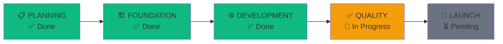

# Dale v3.0 - Project Status Tracker

**Last Updated**: 2026-01-05\
**Overall Progress**: 82% (9/11 phases)\
**Status**: 🟢 Active Development

---

## 📊 Current Status at a Glance



---

## ✅ Phase 1: PLANNING - COMPLETE

| Item                    | Status | Notes                             |
| ----------------------- | ------ | --------------------------------- |
| User stories documented | ✅     | 10 stories in `specs/ride-mvp.md` |
| Tech stack decided      | ✅     | Next.js + FastAPI + Supabase      |
| Architecture diagrams   | ✅     | Documented in specs               |
| Database schema         | ✅     | User, Ride, Booking tables        |
| API contracts           | ✅     | 13 endpoints defined              |
| Repo initialized        | ✅     | Monorepo structure                |

---

## ✅ Phase 2: FOUNDATION - COMPLETE

| Item                        | Status | Notes                     |
| --------------------------- | ------ | ------------------------- |
| Frontend running locally    | ✅     | Next.js on port 3000      |
| Backend running locally     | ✅     | FastAPI on port 8000/8080 |
| Database migrations applied | ✅     | Supabase tables created   |
| Auth system working         | ✅     | JWT + Supabase Auth       |
| Design system established   | ✅     | Kirk UI components        |
| CI pipeline running         | ✅     | GitHub Actions            |

---

## ✅ Phase 3: DEVELOPMENT - COMPLETE

### Backend API (13 Endpoints)

| Feature             | Endpoint                           | Status |
| ------------------- | ---------------------------------- | ------ |
| **Users**           |                                    |        |
| Get my profile      | GET `/api/me`                      | ✅     |
| Update profile      | PATCH `/api/me`                    | ✅     |
| Get public profile  | GET `/api/users/{id}`              | ✅     |
| **Rides**           |                                    |        |
| Create ride         | POST `/api/rides`                  | ✅     |
| Search rides        | GET `/api/rides`                   | ✅     |
| Get ride details    | GET `/api/rides/{id}`              | ✅     |
| Get my rides        | GET `/api/rides/my/rides`          | ✅     |
| Delete ride         | DELETE `/api/rides/{id}`           | ✅     |
| **Bookings**        |                                    |        |
| Create booking      | POST `/api/bookings`               | ✅     |
| Get my bookings     | GET `/api/bookings`                | ✅     |
| Get booking details | GET `/api/bookings/{id}`           | ✅     |
| Cancel booking      | DELETE `/api/bookings/{id}`        | ✅     |
| Confirm booking     | PATCH `/api/bookings/{id}/confirm` | ✅     |

### Frontend Pages

| Page         | Route       | Status |
| ------------ | ----------- | ------ |
| Landing      | `/`         | ✅     |
| Login        | `/login`    | ✅     |
| Signup       | `/signup`   | ✅     |
| Search rides | `/rides`    | ✅     |
| Offer ride   | `/offer`    | ✅     |
| My bookings  | `/bookings` | ✅     |
| Profile      | `/profile`  | ✅     |

---

## 🔄 Phase 4: QUALITY - IN PROGRESS

### 4.1 Testing

| Item                      | Status | Notes                       |
| ------------------------- | ------ | --------------------------- |
| Backend pytest            | ✅     | API endpoint tests          |
| Frontend E2E (Playwright) | ✅     | Auth, rides, bookings flows |
| Test coverage >80%        | ⬜     | Needs verification          |

### 4.2 Performance

| Metric                   | Target | Current | Status                |
| ------------------------ | ------ | ------- | --------------------- |
| Lighthouse Performance   | >90    | ?       | ⬜ Needs audit        |
| Lighthouse Accessibility | >90    | ?       | ⬜ Needs audit        |
| API Response Time        | <200ms | ?       | ⬜ Needs verification |

### 4.3 PWA (Phase 10 in your system)

| Item            | Status | Notes                                 |
| --------------- | ------ | ------------------------------------- |
| Manifest file   | ✅     | Complete with scope, lang, categories |
| Service worker  | ✅     | Registered and active                 |
| App icons       | ✅     | 192x192, 512x512 + apple-touch-icon   |
| Offline support | ✅     | Via Workbox/next-pwa                  |
| Install prompt  | ✅     | Automatic via browser                 |

### 4.4 Accessibility Audit

| Item                  | Status | Notes |
| --------------------- | ------ | ----- |
| Run axe accessibility | ⬜     |       |
| Fix contrast issues   | ⬜     |       |
| Add ARIA labels       | ⬜     |       |
| Keyboard navigation   | ⬜     |       |

---

## ⏳ Phase 5: LAUNCH - PENDING

### 5.1 Pre-Launch

| Item                     | Status | Notes                     |
| ------------------------ | ------ | ------------------------- |
| Production env vars      | ⬜     |                           |
| Secrets rotated          | ⬜     | JWT secret is placeholder |
| SSL certificates         | ⬜     |                           |
| Database backup strategy | ⬜     |                           |

### 5.2 Deployment

| Item              | Status | Notes                       |
| ----------------- | ------ | --------------------------- |
| Frontend → Vercel | ⬜     | Configured but not deployed |
| Backend → Railway | ⬜     | Docker ready                |
| Custom domain     | ⬜     |                             |
| DNS configured    | ⬜     |                             |

### 5.3 Monitoring

| Item                    | Status | Notes |
| ----------------------- | ------ | ----- |
| Error tracking (Sentry) | ⬜     |       |
| Performance monitoring  | ⬜     |       |
| Uptime monitoring       | ⬜     |       |

---

## 🎯 Immediate Next Steps

### This Week Priority

1. **Complete PWA** (Phase 10)
   - [ ] Generate app icons (192x192, 512x512)
   - [ ] Implement service worker
   - [ ] Test installation on mobile

2. **Accessibility Audit**
   - [ ] Run Lighthouse accessibility audit
   - [ ] Fix any contrast issues
   - [ ] Add missing ARIA labels

3. **Performance Optimization**
   - [ ] Run bundle analysis
   - [ ] Optimize images with Next Image
   - [ ] Target Lighthouse >90

### Commands to Run

```bash
# Run Lighthouse audit
npx lighthouse http://localhost:3000 --output html --output-path ./lighthouse-report.html

# Bundle analysis
npm run build && npx @next/bundle-analyzer

# Run all tests
cd backend && pytest
cd frontend && npx playwright test
```

---

## 📋 Weekly Review

### Week of 2026-01-05

**Completed**:

- Phases 1-9 stable
- Frontend and backend running locally

**In Progress**:

- PWA completion
- Accessibility audit

**Blocked**:

- None

**Notes**:

- Node.js v18 warning - consider upgrade for production

---

## 🔗 Quick Links

| Resource           | Link                                                                 |
| ------------------ | -------------------------------------------------------------------- |
| Frontend Dev       | http://localhost:3000                                                |
| Backend API        | http://localhost:8080                                                |
| API Docs (Swagger) | http://localhost:8080/docs                                           |
| API Docs (ReDoc)   | http://localhost:8080/redoc                                          |
| Supabase Dashboard | https://supabase.com/dashboard/project/sydhgjtsgqyglqulxfvh          |
| Project Status     | [PROJECT_STATUS.md](./PROJECT_STATUS.md)                             |
| Full Framework     | [PROJECT_MANAGEMENT_FRAMEWORK.md](./PROJECT_MANAGEMENT_FRAMEWORK.md) |
