# Project Management Framework: Start to Launch

A comprehensive guide for app development from inception to production
deployment.

---

## 🎯 Framework Overview

This framework provides structure and checkpoints across **5 phases** of
development:

```mermaid
graph LR
    A[📋 PLANNING] --> B[🏗️ FOUNDATION]
    B --> C[⚙️ DEVELOPMENT]
    C --> D[✅ QUALITY]
    D --> E[🚀 LAUNCH]
```



| Phase           | Focus                             | Exit Criteria                       |
| --------------- | --------------------------------- | ----------------------------------- |
| **Planning**    | Define scope, specs, architecture | Approved specifications             |
| **Foundation**  | Setup infrastructure, scaffolding | Working dev environment             |
| **Development** | Build features iteratively        | All features implemented            |
| **Quality**     | Testing, optimization, polish     | All tests passing, audit scores met |
| **Launch**      | Deploy, monitor, iterate          | Live in production                  |

---

## Phase 1: 📋 PLANNING

> **Goal**: Define exactly what you're building before writing code.

### 1.1 Requirements Gathering

- [ ] **User Stories** - Document who uses the app and what they need
  - Format: "As a [user type], I want [capability] so that [benefit]"
  - Prioritize: Must-have (MVP) vs Nice-to-have (V2)

- [ ] **Feature Specification** - Detail each feature
  - Inputs, outputs, edge cases
  - UI mockups or wireframes
  - Data models required

- [ ] **Acceptance Criteria** - Define "done"
  - Specific, testable conditions
  - Performance targets (load time, response time)

### 1.2 Technical Architecture

- [ ] **Tech Stack Decision** - Choose and document technologies
  - Frontend (Next.js, React, etc.)
  - Backend (FastAPI, Node.js, etc.)
  - Database (Supabase, PostgreSQL, etc.)
  - Infrastructure (Vercel, Railway, AWS, etc.)

- [ ] **System Design** - Document architecture
  - High-level architecture diagram
  - API contract definitions
  - Database schema design
  - Authentication strategy

- [ ] **Environment Setup Plan**
  - Development, staging, production environments
  - Environment variables documentation
  - Secrets management strategy

### 1.3 Project Setup

- [ ] **Repository Structure** - Organize codebase
  ```
  /
  ├── frontend/          # Frontend application
  ├── backend/           # Backend API
  ├── docs/              # Documentation
  ├── specs/             # Spec-Driven Development specs
  ├── .github/           # CI/CD workflows
  └── README.md          # Project overview
  ```

- [ ] **Documentation Foundation**
  - README.md with setup instructions
  - Contributing guidelines
  - Code style guide

### 📊 Phase 1 Checklist

| Item                    | Status | Owner | Notes |
| ----------------------- | ------ | ----- | ----- |
| User stories documented | ⬜     |       |       |
| Tech stack decided      | ⬜     |       |       |
| Architecture diagrams   | ⬜     |       |       |
| Database schema         | ⬜     |       |       |
| API contracts           | ⬜     |       |       |
| Repo initialized        | ⬜     |       |       |

---

## Phase 2: 🏗️ FOUNDATION

> **Goal**: Establish infrastructure so development can proceed smoothly.

### 2.1 Development Environment

- [ ] **Local Setup**
  - Package managers (npm, pip, etc.)
  - Environment variables (.env files)
  - Docker compose for local services

- [ ] **Database Setup**
  - Create database instance
  - Apply initial migrations
  - Seed development data

- [ ] **Third-Party Services**
  - Authentication provider setup
  - Cloud storage configuration
  - Email/notification services

### 2.2 Frontend Scaffolding

- [ ] **Project Initialization**
  - Framework setup (Next.js app, Vite, etc.)
  - TypeScript configuration
  - Linting and formatting (ESLint, Prettier)

- [ ] **Design System Foundation**
  - Color palette and theme
  - Typography scale
  - Spacing system
  - Component library setup

- [ ] **Core Components**
  - Button, Input, Card, Modal
  - Layout components (Header, Footer, Navigation)
  - Loading and error states

### 2.3 Backend Scaffolding

- [ ] **API Framework Setup**
  - Project structure
  - Error handling middleware
  - CORS configuration

- [ ] **Database Integration**
  - ORM/client setup
  - Connection pooling
  - Migration system

- [ ] **Authentication System**
  - JWT or session management
  - User registration flow
  - Password reset flow
  - Authorization middleware

### 2.4 DevOps Foundation

- [ ] **Version Control**
  - Branching strategy (main, develop, feature branches)
  - Pull request template
  - Branch protection rules

- [ ] **CI/CD Pipeline**
  - Lint on push
  - Type checking
  - Test automation

### 📊 Phase 2 Checklist

| Item                        | Status | Owner | Notes |
| --------------------------- | ------ | ----- | ----- |
| Frontend running locally    | ⬜     |       |       |
| Backend running locally     | ⬜     |       |       |
| Database migrations applied | ⬜     |       |       |
| Auth system working         | ⬜     |       |       |
| Design system established   | ⬜     |       |       |
| CI pipeline running         | ⬜     |       |       |

---

## Phase 3: ⚙️ DEVELOPMENT

> **Goal**: Build features systematically following specs.

### 3.1 Feature Development Cycle

For each feature, follow this cycle:


### 3.2 Backend Development

For each API endpoint:

- [ ] Define route and method
- [ ] Create request/response schemas
- [ ] Implement business logic
- [ ] Add validation
- [ ] Handle errors gracefully
- [ ] Document in OpenAPI/Swagger

### 3.3 Frontend Development

For each page/feature:

- [ ] Create page route
- [ ] Build UI components
- [ ] Connect to API
- [ ] Handle loading states
- [ ] Handle error states
- [ ] Add form validation
- [ ] Ensure responsive design

### 3.4 Integration Points

- [ ] **API Client** - Type-safe API calls
- [ ] **State Management** - Global state if needed
- [ ] **Error Boundaries** - Catch and display errors
- [ ] **Authentication Flow** - Protected routes

### 📊 Feature Tracking Template

| Feature   | Spec | Backend | Frontend | Tests | Merged |
| --------- | ---- | ------- | -------- | ----- | ------ |
| User Auth | ✅   | ⬜      | ⬜       | ⬜    | ⬜     |
| Feature 2 | ⬜   | ⬜      | ⬜       | ⬜    | ⬜     |
| Feature 3 | ⬜   | ⬜      | ⬜       | ⬜    | ⬜     |

---

## Phase 4: ✅ QUALITY

> **Goal**: Ensure the app is reliable, performant, and polished.

### 4.1 Testing

- [ ] **Unit Tests**
  - Backend: API endpoints, business logic
  - Frontend: Component rendering, utilities
  - Coverage target: >80%

- [ ] **Integration Tests**
  - API workflow tests
  - Database transaction tests

- [ ] **End-to-End Tests**
  - Critical user flows
  - Cross-browser testing
  - Mobile responsiveness

### 4.2 Performance Optimization

- [ ] **Frontend Performance**
  - Lighthouse score >90
  - Code splitting
  - Image optimization
  - Bundle size analysis

- [ ] **Backend Performance**
  - Database query optimization
  - Response time <200ms
  - Connection pooling

### 4.3 Security Audit

- [ ] **Common Vulnerabilities**
  - XSS protection
  - CSRF protection
  - SQL injection prevention
  - Input sanitization

- [ ] **Authentication Security**
  - Token expiration
  - Secure cookie settings
  - Rate limiting

### 4.4 Accessibility

- [ ] **WCAG Compliance**
  - Semantic HTML
  - ARIA labels
  - Color contrast (4.5:1 minimum)
  - Keyboard navigation

### 4.5 PWA Requirements (if applicable)

- [ ] **Progressive Web App**
  - Manifest file
  - Service worker
  - Offline support
  - App icons (all sizes)
  - Install prompt

### 📊 Quality Metrics

| Metric                   | Target | Current | Status |
| ------------------------ | ------ | ------- | ------ |
| Lighthouse Performance   | >90    |         | ⬜     |
| Lighthouse Accessibility | >90    |         | ⬜     |
| Test Coverage            | >80%   |         | ⬜     |
| API Response Time        | <200ms |         | ⬜     |
| Bundle Size              | <500KB |         | ⬜     |

---

## Phase 5: 🚀 LAUNCH

> **Goal**: Deploy to production and ensure smooth operation.

### 5.1 Pre-Launch Checklist

- [ ] **Environment Configuration**
  - Production environment variables
  - Secrets rotated from development
  - SSL certificates

- [ ] **Database Production**
  - Production database provisioned
  - Migrations applied
  - Backup strategy configured

- [ ] **Monitoring Setup**
  - Error tracking (Sentry, etc.)
  - Performance monitoring
  - Uptime monitoring

### 5.2 Deployment

- [ ] **Frontend Deployment**
  - Build optimization
  - CDN configuration
  - Custom domain setup

- [ ] **Backend Deployment**
  - Container/serverless setup
  - Health check endpoints
  - Auto-scaling if needed

- [ ] **DNS & Domain**
  - Domain purchased
  - DNS records configured
  - SSL certificates active

### 5.3 Launch Day

- [ ] **Final Verification**
  - Full E2E test in production
  - Payment flows (if applicable)
  - Email deliverability

- [ ] **Go Live**
  - Switch DNS
  - Verify site accessible
  - Monitor error rates

- [ ] **Announcement**
  - Update status page
  - Notify stakeholders

### 5.4 Post-Launch

- [ ] **Monitoring**
  - Review error logs daily
  - Monitor performance metrics
  - Track user feedback

- [ ] **Iteration**
  - Collect user feedback
  - Prioritize improvements
  - Plan next release

### 📊 Launch Checklist

| Item                      | Status | Verified By | Date |
| ------------------------- | ------ | ----------- | ---- |
| Production env configured | ⬜     |             |      |
| SSL certificates active   | ⬜     |             |      |
| Monitoring active         | ⬜     |             |      |
| Backup system tested      | ⬜     |             |      |
| E2E tests passing         | ⬜     |             |      |
| Frontend deployed         | ⬜     |             |      |
| Backend deployed          | ⬜     |             |      |
| Domain active             | ⬜     |             |      |

---

## 🔧 Tools & Commands Reference

### Development

```bash
# Frontend
npm run dev           # Start development server
npm run build         # Production build
npm run lint          # Check linting

# Backend
uvicorn main:app --reload    # Start API server
pytest                        # Run tests
```

### Testing

```bash
# Frontend E2E
npx playwright test

# Backend Tests
pytest --cov=app
```

### Deployment

```bash
# Frontend (Vercel)
vercel --prod

# Backend (Railway/Docker)
docker build -t app .
docker push
```

---

## 📊 Progress Dashboard

### Overall Status

| Phase          | Progress    | Status         |
| -------------- | ----------- | -------------- |
| 1. Planning    | ███████████ | ✅ Complete    |
| 2. Foundation  | ███████████ | ✅ Complete    |
| 3. Development | ████████░░  | 🔄 In Progress |
| 4. Quality     | █████░░░░░  | 🔄 In Progress |
| 5. Launch      | ░░░░░░░░░░  | ⏳ Pending     |

### Current Sprint Focus

- **Primary**: [Current main focus]
- **Secondary**: [Next priority]
- **Blocked**: [Any blockers]

---

## 📝 Weekly Review Template

### What was accomplished this week?

-

### What's planned for next week?

-

### Any blockers or concerns?

-

### Metrics Update

- Test coverage:
- Lighthouse score:
- Open bugs:

---

## 🔗 Quick Links

| Resource        | Link                  |
| --------------- | --------------------- |
| Live App        | [Production URL]      |
| API Docs        | [Swagger/OpenAPI URL] |
| Design System   | [Figma/Storybook]     |
| Repository      | [GitHub URL]          |
| CI/CD Dashboard | [GitHub Actions]      |
| Error Tracking  | [Sentry Dashboard]    |
| Database        | [Supabase Dashboard]  |

---

_Last Updated: 2026-01-05_
