# Project Status: Dale v3.0

**Last Updated**: 2026-01-06 **Overall Status**: 🟢 Active Development **Current
Phase**: Phase 4: QUALITY

---

## 🎯 Executive Summary

The project is currently in the **Quality Assurance** phase, focused on
stabilizing the application, completing the PWA implementation, and preparing
for deployment. The core functionality (Foundation and Development phases) is
complete.

```mermaid
graph LR
    A[📋 PLANNING<br/>✅ Done] --> B[🏗️ FOUNDATION<br/>✅ Done]
    B --> C[⚙️ DEVELOPMENT<br/>✅ Done]
    C --> D[✅ QUALITY<br/>🔄 In Progress]
    D --> E[🚀 LAUNCH<br/>⏳ Pending]
    
    style A fill:#10b981
    style B fill:#10b981
    style C fill:#10b981
    style D fill:#f59e0b
    style E fill:#6b7280
```

---

## ✅ Phase 1: PLANNING (Completed)

> **Goal**: Define exactly what you're building before writing code.

- **Status**: ✅ Completed
- **Deliverables**:
  - [x] **User Stories**: Documented in `specs/ride-mvp.md` (10 stories).
  - [x] **Tech Stack**: Next.js 14, FastAPI, Supabase, TailwindCSS v4.
  - [x] **Architecture**: Monorepo structure established.
  - [x] **Data Models**: User, Ride, Booking tables defined.
  - [x] **API Contracts**: 13 endpoints defined and documented.

---

## ✅ Phase 2: FOUNDATION (Completed)

> **Goal**: Establish infrastructure so development can proceed smoothly.

- **Status**: ✅ Completed
- **Deliverables**:
  - [x] **Repo Structure**: Monorepo with `/frontend` and `/backend`.
  - [x] **Frontend Setup**: Next.js App Router, Tailwind v4, Kirk UI components.
  - [x] **Backend Setup**: FastAPI, Prisma (Client), Docker environment.
  - [x] **Database**: Supabase project connected, migrations applied, seeded
        with 5 users/5 rides.
  - [x] **Authentication**: JWT middleware integrated with Supabase Auth.
  - [x] **CI/CD**: GitHub Actions for testing and deployment configured.

---

## ✅ Phase 3: DEVELOPMENT (Completed)

> **Goal**: Build features systematically following specs.

- **Status**: ✅ Completed
- **Deliverables**:

### Backend API (13 Endpoints)

- [x] **Users**: Get profile, update profile, public profile.
- [x] **Rides**: Create, search (with filters), get details, list my rides,
      delete ride.
- [x] **Bookings**: Create booking, list my bookings, get details, cancel,
      confirm.

### Frontend Pages

- [x] **Public**: Landing (`/`), Login (`/login`), Signup (`/signup`).
- [x] **App**: Search Rides (`/rides`), Offer Ride (`/offer`), My Bookings
      (`/bookings`), Profile (`/profile`).

### Key Features

- [x] **Search**: Reactive filters for origin, destination, and date.
- [x] **Booking Logic**: Seat decrement/increment, duplicate checks, permission
      checks.
- [x] **UI**: Responsive design using "Kirk UI" styled components (Cards,
      Inputs, Modals).

---

## 🔄 Phase 4: QUALITY (In Progress)

> **Goal**: Ensure the app is reliable, performant, and polished.

- **Status**: 🔄 In Progress

### 4.1 Testing

- [x] **Backend Tests**: `pytest` coverage for API endpoints and business logic.
- [x] **E2E Tests**: Playwright tests for Auth, Ride Search, and Booking flows.
- [ ] **Test Coverage**: Verify >80% coverage.

### 4.2 Application Polish & PWA

- [x] **PWA Manifest**: `manifest.json` properly configured.
- [x] **Service Worker**: `next-pwa` installed.
- [ ] **PWA Assets**: Generate real icons (192x192, 512x512).
- [ ] **Accessibility**: Run axe/Lighthouse audit and fix contrast/ARIA issues.
- [ ] **Performance**: Lighthouse score >90 target.

---

## ⏳ Phase 5: LAUNCH (Pending)

> **Goal**: Deploy to production and ensure smooth operation.

- **Status**: ⏳ Pending

### Pre-Launch Checklist

- [ ] **Environment**: Set production variables in Vercel/Railway.
- [ ] **Secrets**: Rotate JWT secrets (currently using placeholder).
- [ ] **Domain**: Configure custom domain and DNS.
- [ ] **Monitoring**: Set up Sentry for error tracking.

### Deployment Targets

- **Frontend**: Vercel (Configured)
- **Backend**: Railway / Supabase Edge Functions (Docker ready)

---

## 📝 Immediate Next Steps

1. **Finalize PWA**:
   - [ ] Generate and replace PWA icons.
   - [ ] Validate offline capabilities.
2. **Accessibility Audit**:
   - [ ] Run `npx lighthouse http://localhost:3000`
   - [ ] Fix identified accessibility issues.
3. **Documentation**:
   - [ ] Set up MkDocs for developer documentation (Phase 11 in old plan).

---

## 🔗 Quick Reference

- **Frontend**: http://localhost:3000
- **Backend API**: http://localhost:8000
- **API Docs**: http://localhost:8000/docs
- **Supabase**:
  [Dashboard Link](https://supabase.com/dashboard/project/sydhgjtsgqyglqulxfvh)
- **Framework**:
  [PROJECT_MANAGEMENT_FRAMEWORK.md](./PROJECT_MANAGEMENT_FRAMEWORK.md)
