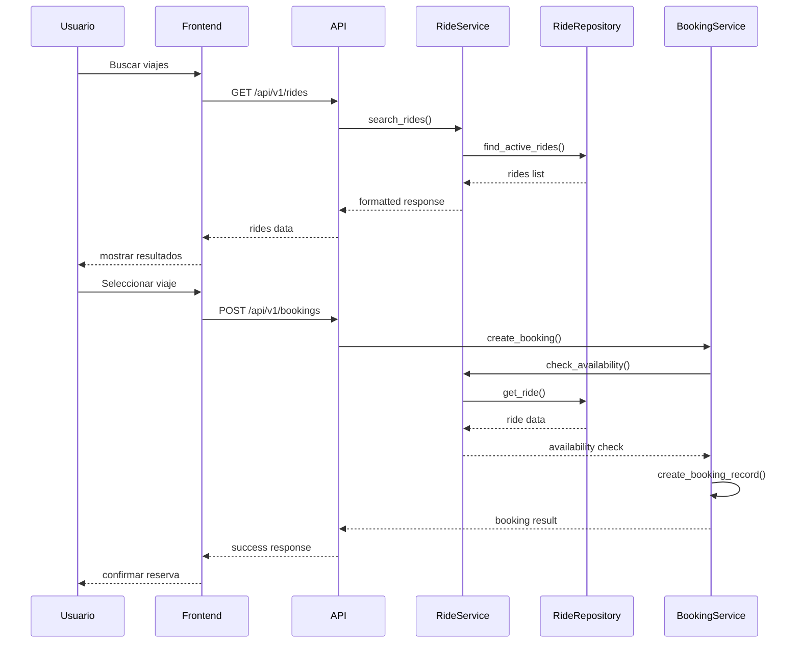

# Guía de Contribución

## 🤝 ¡Bienvenido a Dale!

Gracias por tu interés en contribuir al proyecto Dale. Esta guía te ayudará a empezar a contribuir de manera efectiva, ya sea corrigiendo bugs, añadiendo features, mejorando la documentación o ayudando con el testing.

## 📋 Table de Contenidos

- [🚀 Cómo Contribuir](#-cómo-contribuir)
- [⚙️ Setup del Entorno](#️-setup-del-entorno)
- [🐛 Reportar Bugs](#-reportar-bugs)
- [💡 Proponer Features](#-proponer-features)
- [📝 Estándares de Código](#-estándares-de-código)
- [🧪 Testing](#-testing)
- [📚 Documentación](#-documentación)
- [🎯 Proceso de Review](#-proceso-de-review)
- [🏷️ Release Process](#-release-process)
- [❓ Preguntas Frecuentes](#-preguntas-frecuentes)

## 🚀 Cómo Contribuir

### 🎯 Tipos de Contribuciones

#### 🐛 Bug Fixes
- Corregir errores de código
- Solucionar problemas de performance
- Arreglar bugs de UI/UX

#### 💡 Nuevas Features
- Funcionalidades nuevas para usuarios
- Mejoras en APIs existentes
- Integraciones con servicios externos

#### 📚 Documentación
- Mejorar documentación existente
- Crear tutoriales y guías
- Traducir documentación

#### 🧪 Testing
- Añadir tests unitarios
- Crear tests de integración
- Mejorar coverage de tests

#### 🎨 UX/UI
- Mejoras de diseño
- Optimizaciones de usabilidad
- Responsive design

### 🌟 Ways to Contribute

#### Para Principiantes
1. **Corrección de typos** en código o documentación
2. **Mejoras de documentación** (clarificar, añadir ejemplos)
3. **Issues etiquetados** con `good-first-issue`
4. **Tests simples** para funcionalidades existentes

#### Para Desarrolladores Intermedios
1. **Bug fixes** sin acompañamiento
2. **Features pequeñas** con especificaciones claras
3. **Refactoring** de código existente
4. **Mejoras de performance**

#### Para Desarrolladores Avanzados
1. **Features complejas** con diseño arquitectónico
2. **Mejoras de arquitectura** del sistema
3. **Integraciones** con servicios externos
4. **Optimizaciones** de base de datos y APIs

## ⚙️ Setup del Entorno

### Prerrequisitos

Antes de contribuir, asegúrate de tener instalado:

```bash
# Git
git --version

# Node.js 18+
node --version

# Python 3.11+
python3.11 --version

# npm o yarn
npm --version
```

### 1. Fork y Clone

```bash
# 1. Fork el repositorio en GitHub
# 2. Clonar tu fork
git clone https://github.com/YOUR_USERNAME/dale.git
cd dale

# 3. Añadir el repositorio original como upstream
git remote add upstream https://github.com/dale/app.git
```

### 2. Setup del Proyecto

```bash
# Backend setup
cd backend
python3.11 -m venv venv
source venv/bin/activate  # Linux/macOS
# venv\Scripts\activate   # Windows
pip install -r requirements.txt

# Frontend setup
cd ../frontend
npm install

# Configurar Git hooks
cd ..
cp scripts/pre-commit .git/hooks/pre-commit
chmod +x .git/hooks/pre-commit
```

### 3. Variables de Entorno

```bash
# Crear archivos de configuración
cp backend/.env.example backend/.env
cp frontend/.env.example frontend/.env.local

# Editar con tus credenciales
nano backend/.env
nano frontend/.env.local
```

### 4. Verificar Setup

```bash
# Test de backend
cd backend && source venv/bin/activate && python -m pytest

# Test de frontend
cd frontend && npm test

# Iniciar servicios
./scripts/start.sh
```

## 🐛 Reportar Bugs

### Antes de Reportar

1. **Busca** si ya existe un issue similar
2. **Reproduce** el bug en la última versión
3. **Verifica** que no es un problema de configuración

### Template de Bug Report

```markdown
**Descripción del Bug**
Descripción clara y concisa del bug.

**Para Reproducir**
1. Ve a '...'
2. Click en '...'
3. Scroll hasta '...'
4. Ver error

**Comportamiento Esperado**
Descripción de lo que esperabas que pasara.

**Screenshots**
Si aplica, añade screenshots del problema.

**Información del Entorno:**
- OS: [e.g. iOS, Windows, macOS]
- Browser [e.g. chrome, safari, edge]
- Version [e.g. 22, 91.0.4472.124]
- Dale Version: [e.g. 1.0.0]
- Node.js Version: [e.g. 18.17.0]
- Python Version: [e.g. 3.11.0]

**Contexto Adicional**
Añade cualquier contexto adicional sobre el problema.
```

### Prioridades de Bug

#### 🔴 Critical
- Sistema down o unusable
- Pérdida de datos
- Problemas de seguridad
- **Response Time**: < 24 horas

#### 🟠 High  
- Funcionalidad principal rota
- Performance severa
- **Response Time**: < 1 semana

#### 🟡 Medium
- Problemas menores de UI
- Edge cases no manejados
- **Response Time**: < 2 semanas

#### 🟢 Low
- Mejoras cosméticas
- Documentación
- **Response Time**: < 1 mes

## 💡 Proponer Features

### Antes de Proponer

1. **Revisa** si la feature ya está propuesta
2. **Busca** issues relacionados
3. **Considera** la complejidad vs beneficio

### Template de Feature Request

```markdown
**Resumen de Feature**
Descripción breve y clara de la feature.

**Problema que Resuelve**
¿Qué problema resuelve esta feature?

**Solución Propuesta**
Descripción de lo que quieres que pase.

**Alternativas Consideradas**
Descripción de cualquier alternativa que hayas considerado.

**Contexto Adicional**
Screenshots, mockups, o cualquier contexto adicional.

**Implementación Sugerida**
Si tienes ideas sobre cómo implementar:

1. Backend changes needed
2. Frontend changes needed  
3. Database schema changes
4. New APIs needed
```

### Criterios de Aceptación

Para que una feature sea aceptada, debe:

- ✅ **Resolver un problema real** para usuarios
- ✅ **Ser consistente** con la arquitectura existente
- ✅ **Tener tests** que cubran la funcionalidad
- ✅ **Incluir documentación** necesaria
- ✅ **Ser mantenible** y escalable
- ✅ **Pasar CI/CD** sin errores

## 📝 Estándares de Código

### Principios Generales

Sigue los principios **SOLID** y **Clean Architecture**:

- **Single Responsibility**: Una clase, una responsabilidad
- **Open/Closed**: Abierto para extensión, cerrado para modificación
- **Liskov Substitution**: Subtipos sustituibles por sus supertipos
- **Interface Segregation**: Interfaces específicas en lugar de generales
- **Dependency Inversion**: Depender de abstracciones, no implementaciones

### Python Guidelines

#### Estilo de Código

```python
# ✅ Good - Usar type hints
from typing import List, Optional

def create_ride(data: CreateRideDTO) -> Result[Ride]:
    """Crear un nuevo viaje con validaciones."""
    pass

# ❌ Bad - Sin type hints
def create_ride(data):
    pass
```

#### Estructura de Archivos

```python
# Estructura recomendada
app/
├── models/           # Entidades del dominio
│   ├── __init__.py
│   ├── user.py      # Modelos de usuario
│   └── ride.py      # Modelos de viaje
├── services/         # Lógica de negocio
│   ├── __init__.py
│   ├── ride_service.py
│   └── user_service.py
├── repositories/     # Acceso a datos
│   ├── __init__.py
│   ├── base.py
│   └── ride_repo.py
└── api/             # Controladores HTTP
    ├── __init__.py
    ├── v1/
    │   ├── __init__.py
    │   └── rides.py
    └── deps.py
```

#### Naming Conventions

```python
# Clases: PascalCase
class RideService:
    pass

# Funciones y variables: snake_case
def create_ride():
    available_seats = 3

# Constantes: UPPER_SNAKE_CASE
MAX_RIDE_DISTANCE = 1000

# Private methods: prefix underscore
class RideService:
    def _validate_ride_data(self, data):
        pass
```

#### Error Handling

```python
# ✅ Good - Usar Result pattern
from typing import Generic, TypeVar

T = TypeVar('T')

class Result(Generic[T]):
    def __init__(self, success: bool, value: Optional[T] = None, error: Optional[Error] = None):
        self.success = success
        self.value = value
        self.error = error
    
    @staticmethod
    def success(value: T) -> 'Result[T]':
        return Result(True, value)
    
    @staticmethod
    def failure(error: Error) -> 'Result[T]':
        return Result(False, error=error)

# Uso
def create_ride(data: CreateRideDTO) -> Result[Ride]:
    if not data.is_valid():
        return Result.failure(ValidationError("Invalid data"))
    
    ride = Ride.create(data)
    return Result.success(ride)
```

### TypeScript Guidelines

#### Estilo de Código

```typescript
// ✅ Good - Interfaces explícitas
interface Ride {
  id: string;
  driverId: string;
  from: Location;
  to: Location;
  departureTime: Date;
  availableSeats: number;
  pricePerSeat: number;
}

// ❌ Bad - Sin tipos explícitos
const ride = {
  id: '',
  // ... sin tipos
};
```

#### Estructura de Componentes

```typescript
// Componentes funcionales con hooks
import React, { useState, useEffect } from 'react';

interface RideCardProps {
  ride: Ride;
  onBook?: (rideId: string) => void;
  onCancel?: (rideId: string) => void;
}

export const RideCard: React.FC<RideCardProps> = ({ ride, onBook, onCancel }) => {
  const [isLoading, setIsLoading] = useState(false);

  const handleBook = async () => {
    setIsLoading(true);
    try {
      await onBook?.(ride.id);
    } finally {
      setIsLoading(false);
    }
  };

  return (
    <div className="ride-card">
      {/* Component JSX */}
    </div>
  );
};
```

### Git Guidelines

#### Commits

```bash
# ✅ Good - Commits descriptivos
git commit -m "feat: add ride booking functionality

- Add BookingService with validation logic
- Create BookingController with POST /bookings endpoint
- Add unit tests for booking workflow
- Update API documentation

Closes #123"

# ❌ Bad - Commits vagos
git commit -m "fix bug"
git commit -m "update"
```

#### Branch Naming

```bash
# ✅ Good - Branches descriptivos
feature/ride-booking-system
bugfix/search-filters-not-working
docs/update-api-documentation
refactor/improve-error-handling
hotfix/critical-security-patch

# ❌ Bad - Branches vagos
git checkout -b feature1
git checkout -b fix
git checkout -b update
```

#### Pull Request Guidelines

```markdown
## 📝 Descripción

Breve descripción de los cambios realizados.

## 🔄 Cambios Realizados

- ✅ Añadida funcionalidad de booking
- ✅ Mejorada validación de datos
- ✅ Actualizados tests unitarios

## 🧪 Testing

- ✅ Tests unitarios pasando
- ✅ Tests de integración actualizados
- ✅ Testing manual completado

## 📚 Documentación

- [ ] Actualizada documentación de API
- [ ] Añadidos ejemplos de uso
- [ ] Actualizado README si es necesario

## 🚀 Deploy Checklist

- [ ] Build exitoso en staging
- [ ] Configuración de entorno actualizada
- [ ] Variables de entorno configuradas
- [ ] Health checks passing
```

## 🧪 Testing

### Testing Pyramid

```
    /\
   /  \        E2E Tests (Few)
  /____\
 /      \
/        \   Integration Tests (Some)
/          \
/____________\
/              \
/                \  Unit Tests (Many)
```

### Unit Tests (Backend)

```python
# tests/test_ride_service.py
import pytest
from app.services.ride_service import RideService
from app.repositories.ride_repository import MockRideRepository
from app.models.ride import CreateRideDTO

@pytest.fixture
def ride_service():
    repository = MockRideRepository()
    return RideService(repository)

@pytest.fixture
def valid_ride_data():
    return CreateRideDTO(
        driver_id="driver-123",
        from_city="Madrid",
        to_city="Barcelona",
        departure_time="2025-11-15T10:00:00Z",
        seats_total=3,
        price_per_seat=25.00
    )

class TestRideService:
    def test_create_ride_success(self, ride_service, valid_ride_data):
        """Test creating a ride with valid data."""
        # Arrange
        # (Setup data)
        
        # Act
        result = ride_service.create_ride(valid_ride_data)
        
        # Assert
        assert result.is_success
        assert result.value.driver_id == "driver-123"
        assert result.value.status == "active"
    
    def test_create_ride_invalid_seats(self, ride_service):
        """Test creating ride with invalid seat count."""
        # Arrange
        invalid_data = CreateRideDTO(
            driver_id="driver-123",
            # ... other fields
            seats_total=0  # Invalid
        )
        
        # Act
        result = ride_service.create_ride(invalid_data)
        
        # Assert
        assert result.is_failure
        assert "seats_total must be positive" in result.error.message
```

### Frontend Testing

```typescript
// __tests__/components/RideCard.test.tsx
import { render, screen, fireEvent } from '@testing-library/react';
import { RideCard } from '../components/RideCard';
import { Ride } from '../types/ride';

const mockRide: Ride = {
  id: 'ride-123',
  driver: {
    id: 'driver-456',
    name: 'Juan Pérez',
    rating: 4.8
  },
  from: 'Madrid',
  to: 'Barcelona',
  departureTime: '2025-11-15T10:00:00Z',
  availableSeats: 3,
  pricePerSeat: 25.00,
  status: 'active'
};

describe('RideCard', () => {
  const mockOnBook = jest.fn();
  const mockOnCancel = jest.fn();

  beforeEach(() => {
    jest.clearAllMocks();
  });

  it('should render ride information', () => {
    render(
      <RideCard 
        ride={mockRide} 
        onBook={mockOnBook}
        onCancel={mockOnCancel}
      />
    );

    expect(screen.getByText('Madrid')).toBeInTheDocument();
    expect(screen.getByText('Barcelona')).toBeInTheDocument();
    expect(screen.getByText('€25.00')).toBeInTheDocument();
    expect(screen.getByText('Juan Pérez')).toBeInTheDocument();
  });

  it('should call onBook when booking button is clicked', () => {
    render(
      <RideCard 
        ride={mockRide} 
        onBook={mockOnBook}
        onCancel={mockOnCancel}
      />
    );

    fireEvent.click(screen.getByText('Reservar'));

    expect(mockOnBook).toHaveBeenCalledWith('ride-123');
  });
});
```

### Integration Testing

```python
# tests/test_api_integration.py
import pytest
from httpx import AsyncClient
from main import app

@pytest.mark.asyncio
async def test_create_and_get_ride():
    """Test full ride creation and retrieval workflow."""
    async with AsyncClient(app=app, base_url="http://test") as client:
        # Create ride
        ride_data = {
            "driver_id": "driver-123",
            "from_city": "Madrid",
            "to_city": "Barcelona",
            "date_time": "2025-11-15T10:00:00Z",
            "seats_total": 3,
            "price": 25.00
        }
        
        create_response = await client.post("/api/v1/rides", json=ride_data)
        assert create_response.status_code == 201
        
        ride_id = create_response.json()["id"]
        
        # Get ride
        get_response = await client.get(f"/api/v1/rides/{ride_id}")
        assert get_response.status_code == 200
        
        ride = get_response.json()
        assert ride["from_city"] == "Madrid"
        assert ride["to_city"] == "Barcelona"
        assert ride["seats_available"] == 3
```

### E2E Testing

```typescript
// cypress/e2e/ride-booking.cy.ts
describe('Ride Booking Flow', () => {
  it('should complete full booking process', () => {
    // Login
    cy.visit('/login');
    cy.get('[data-cy=email-input]').type('user@example.com');
    cy.get('[data-cy=password-input]').type('password123');
    cy.get('[data-cy=login-button]').click();

    // Search rides
    cy.visit('/rides');
    cy.get('[data-cy=from-city-input]').type('Madrid');
    cy.get('[data-cy=to-city-input]').type('Barcelona');
    cy.get('[data-cy=search-button]').click();

    // Select ride
    cy.get('[data-cy=ride-card]').first().within(() => {
      cy.get('[data-cy=book-button]').click();
    });

    // Complete booking
    cy.get('[data-cy=seats-input]').type('2');
    cy.get('[data-cy=confirm-booking]').click();

    // Verify success
    cy.url().should('include', '/bookings');
    cy.get('[data-cy=success-message]').should('contain', 'Reserva confirmada');
  });
});
```

## 📚 Documentación

### Documentación de Código

```python
class RideService:
    """
    Servicio para gestión de viajes de carpooling.
    
    Esta clase encapsula toda la lógica de negocio relacionada
    con la creación, búsqueda y gestión de viajes.
    
    Example:
        ```python
        service = RideService(ride_repo, booking_repo)
        ride = await service.create_ride(create_dto)
        ```
    """
    
    def create_ride(self, data: CreateRideDTO) -> Result[Ride]:
        """
        Crear un nuevo viaje.
        
        Args:
            data: DTO con información del viaje a crear
            
        Returns:
            Result con el viaje creado o error
            
        Raises:
            ValidationError: Si los datos son inválidos
            BusinessRuleError: Si se violan reglas de negocio
            
        Note:
            El viaje se crea con estado 'active' por defecto
        """
        # Implementation
        pass
```

### Documentación de API

```python
from fastapi import FastAPI, HTTPException
from pydantic import BaseModel

app = FastAPI(
    title="Dale API",
    description="API para la plataforma de carpooling Dale",
    version="1.0.0"
)

class RideResponse(BaseModel):
    """Respuesta de la API para un viaje."""
    id: str
    driver_id: str
    from_city: str
    to_city: str
    date_time: str
    seats_available: int
    price: float

@app.get(
    "/api/v1/rides/{ride_id}",
    response_model=RideResponse,
    summary="Obtener viaje por ID",
    description="""
    Obtiene los detalles de un viaje específico por su ID.
    
    El viaje debe existir y estar en estado 'active'.
    
    Returns:
        RideResponse con los detalles del viaje
        
    Raises:
        404: Si el viaje no existe
        410: Si el viaje está cancelado
    """
)
async def get_ride(ride_id: str):
    """Endpoint para obtener detalles de un viaje."""
    ride = await ride_service.get_by_id(ride_id)
    if not ride:
        raise HTTPException(status_code=404, detail="Ride not found")
    return ride
```

### Documentación de Arquitectura

```markdown
## Ride Booking Flow


```

## 🎯 Proceso de Review

### Para Contributors

#### Antes de Submit PR

1. **Run all tests**: `npm test && pytest`
2. **Check linting**: `npm run lint && flake8`
3. **Update documentation**: Si es necesario
4. **Self-review**: Revisa tu propio código
5. **Smoke testing**: Test básico manual

#### Durante el Review

- **Sé responsive**: Responde comentarios rápidamente
- **Sé abierto**: Acepta feedback constructivo
- **Haz preguntas**: Si no entiendes algo, pregunta
- **Sé paciente**: El review puede tomar tiempo

### Para Reviewers

#### Checklist de Review

```markdown
## Review Checklist

### Código
- [ ] Sigue estándares de código
- [ ] Tiene tests apropiados
- [ ] Maneja errores correctamente
- [ ] No introduce security vulnerabilities
- [ ] Performance es aceptable

### Funcionalidad
- [ ] Cumple requirements del PR
- [ ] No introduce regressions
- [ ] Edge cases están manejados
- [ ] UX es apropiada

### Documentación
- [ ] Comentarios en código claros
- [ ] Documentación actualizada
- [ ] Ejemplos de uso incluidos
- [ ] README actualizado si es necesario

### General
- [ ] Commits organizados
- [ ] Branch naming apropiado
- [ ] PR description completa
- [ ] Changelog actualizado
```

#### Tipos de Comentarios

```markdown
## 💭 Comentarios de Review

### 🔴 Critical
```
Este cambio introduce una vulnerabilidad de seguridad. 
Necesita ser arreglado antes del merge.
```

### 🟡 Improvement
```
Podríamos considerar usar un Result<T> aquí en lugar 
de excepciones para mejor manejo de errores.
```

### 💡 Suggestion
```
Una alternativa podría ser usar un factory method 
aquí para mejor encapsulación.
```

### ✅ Praise
```
Excelente uso de type hints aquí. Hace el código 
mucho más mantenible.
```
```

## 🏷️ Release Process

### Versioning

Usamos [Semantic Versioning](https://semver.org/):

```
MAJOR.MINOR.PATCH
1.0.0

MAJOR: Breaking changes
MINOR: New features (backward compatible)
PATCH: Bug fixes (backward compatible)
```

### Release Checklist

#### Pre-Release

```bash
# 1. Update version numbers
npm version patch  # o minor, major

# 2. Update CHANGELOG.md
# 3. Run all tests
npm test && pytest

# 4. Update documentation
# 5. Smoke testing
./scripts/smoke-test.sh

# 6. Security scan
npm audit && safety check
```

#### Release Steps

1. **Create release branch**: `release/v1.2.0`
2. **Update version files**
3. **Create PR**: From release branch to main
4. **Final review and testing**
5. **Merge to main**
6. **Tag release**: `git tag v1.2.0`
7. **Push tag**: `git push origin v1.2.0`
8. **Create GitHub release**
9. **Deploy to production**

#### Post-Release

```bash
# 1. Deploy to staging
vercel --prod

# 2. Health checks
curl https://your-app.vercel.app/health

# 3. Monitor for 24 hours
# 4. Deploy to production if all good
# 5. Update documentation
# 6. Announce release
```

## ❓ Preguntas Frecuentes

### ¿Cómo puedo empezar a contribuir?

1. **Busca issues** con label `good-first-issue`
2. **Comienza con documentación** o bugs menores
3. **Únete a Discord** para hacer preguntas
4. **Lee la documentación** técnica completa

### ¿Cuánto tiempo toma el review?

- **Documentación**: 1-2 días
- **Bug fixes**: 2-3 días
- **Features pequeñas**: 3-5 días
- **Features grandes**: 1-2 semanas

### ¿Puedo trabajar en features grandes?

Sí, pero recomendamos:
1. **Discute primero** en un issue o Discord
2. **Crea un proposal** detallado
3. **Obtén approval** antes de empezar
4. **Mantén comunicación** durante el desarrollo

### ¿Qué hago si mi PR es rechazado?

- **Lee los comentarios** de review cuidadosamente
- **Discute concerns** con el reviewer
- **Haz los cambios** solicitados
- **Resubmit** con los improvements

### ¿Cómo puedo ayudar con testing?

- **Añade tests** para funcionalidades existentes
- **Reporta bugs** con steps to reproduce
- **Crea tests de regresión** para bugs encontrados
- **Ayuda con E2E testing** en diferentes navegadores

### ¿Hay una compensación?

Actualmente:
- **Voluntario**: Todas las contribuciones son volunteer-based
- **Reconocimiento**: Tu nombre en Contributors page
- **Badge**: GitHub contributors badge
- **Futuro**: Consideramos bounty system para 2026

---

## 🎉 ¡Gracias por Contribuir!

Tu contribución ayuda a hacer Dale mejor para toda la comunidad. Cada PR, issue, o comentario mejora la plataforma.

### 🌟 Contributors Hall of Fame

*Esta sección se actualiza automáticamente con nuevos contributors*

### 📞 Contacto

¿Preguntas sobre contribuir?

- **Discord**: [Comunidad de Dale](https://discord.gg/dale)
- **Email**: [dev@dale-app.com](mailto:dev@dale-app.com)
- **GitHub**: [Crea un issue](https://github.com/dale/app/issues)

---

> **🚀 Tip**: La mejor manera de contribuir es empezar pequeño. Even fixing a typo en la documentación es una contribución valiosa. ¡Bienvenido al equipo Dale! 💙