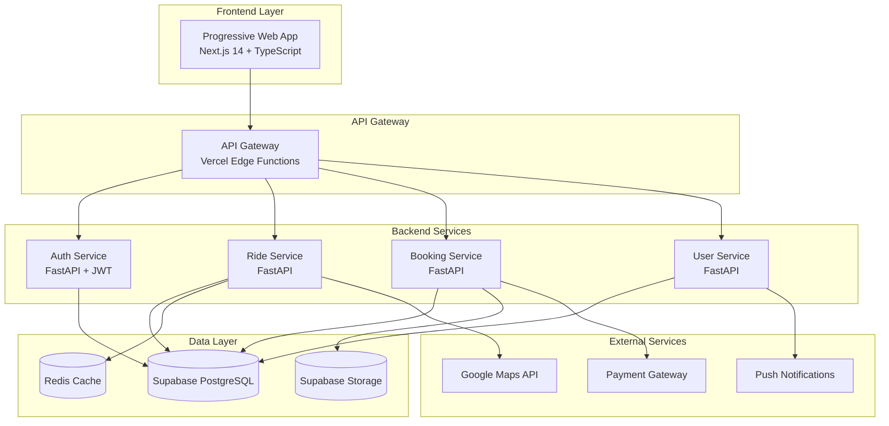
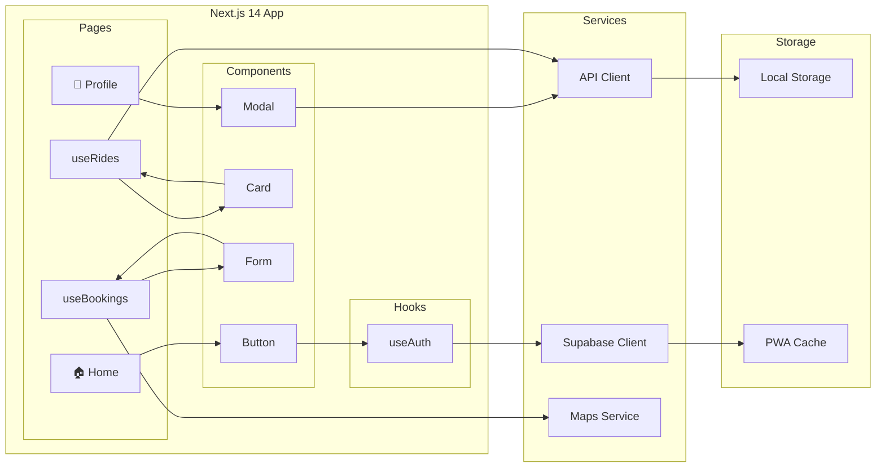
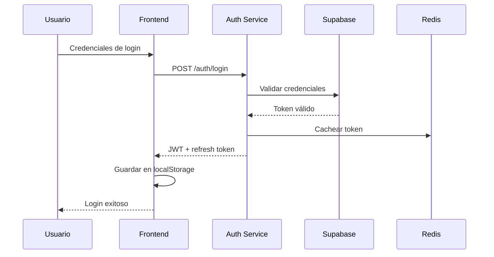
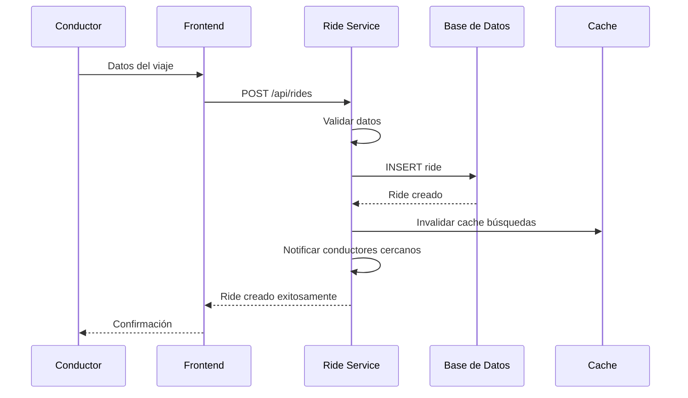
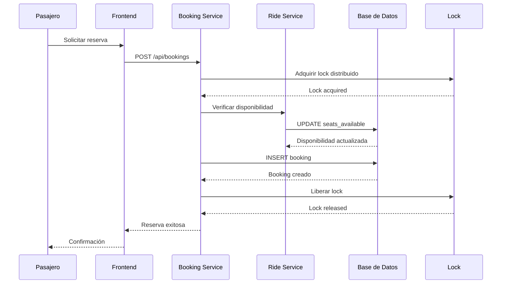
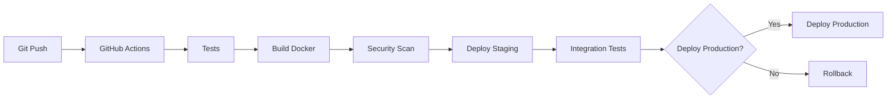

# Arquitectura del Sistema

## 🏗 Visión General

Dale utiliza una **arquitectura de microservicios moderna** diseñada para escalabilidad, mantenibilidad y rendimiento óptimo. El sistema está compuesto por varios servicios independientes que se comunican a través de APIs REST y WebSockets.



## 🎯 Principios Arquitectónicos

### 1. **🔄 Microservicios**
Cada servicio tiene una responsabilidad específica y puede escalarse independientemente.

### 2. **🔌 APIs Primero**
Diseño API-first con documentación automática via OpenAPI/Swagger.

### 3. **🗄️ Base de Datos como Servicio**
Utilización de Supabase para gestión de datos y autenticación.

### 4. **☁️ Cloud-Native**
Arquitectura diseñada específicamente para ejecutarse en la nube.

### 5. **📱 Mobile-First**
Optimizado para dispositivos móviles con capacidades PWA.

## 🏛 Estructura de Servicios

### 🔐 Servicio de Autenticación (Auth Service)

**Responsabilidades:**
- Gestión de tokens JWT
- Autenticación de usuarios
- Autorización y permisos
- Integración con Supabase Auth

**Tecnologías:**
- FastAPI (Python)
- python-jose (JWT)
- Supabase Auth
- Redis (caching)

**Endpoints Principales:**
```http
POST /auth/login
POST /auth/register
POST /auth/logout
GET  /auth/me
POST /auth/refresh
```

### 🚗 Servicio de Viajes (Ride Service)

**Responsabilidades:**
- CRUD de viajes (Create, Read, Update, Delete)
- Búsqueda y filtrado
- Gestión de disponibilidad de asientos
- Geolocalización y mapas

**Tecnologías:**
- FastAPI (Python)
- Supabase Client
- Google Maps API
- PostgreSQL (PostGIS para geolocalización)

**Endpoints Principales:**
```http
POST   /api/rides
GET    /api/rides
GET    /api/rides/{ride_id}
PATCH  /api/rides/{ride_id}
PATCH  /api/rides/{ride_id}/cancel
```

### 🎫 Servicio de Reservas (Booking Service)

**Responsabilidades:**
- Gestión de reservas de asientos
- Actualización automática de disponibilidad
- Estados de reserva
- Notificaciones

**Tecnologías:**
- FastAPI (Python)
- Supabase Client
- Redis (locks distributed)
- WebSockets (tiempo real)

**Endpoints Principales:**
```http
POST   /api/bookings
GET    /api/bookings/{booking_id}
PATCH  /api/bookings/{booking_id}/cancel
GET    /api/users/{user_id}/bookings
```

### 👤 Servicio de Usuarios (User Service)

**Responsabilidades:**
- Perfiles de usuario
- Preferencias y configuraciones
- Historial de actividad
- Sistema de calificaciones

**Tecnologías:**
- FastAPI (Python)
- Supabase Client
- Upload para imágenes
- ML para recomendaciones

**Endpoints Principales:**
```http
GET    /api/users/{user_id}
PATCH  /api/users/{user_id}
GET    /api/users/{user_id}/history
POST   /api/users/{user_id}/rating
```

## 🗄️ Arquitectura de Datos

### Base de Datos Principal (Supabase PostgreSQL)

```sql
-- Esquema principal de la base de datos
CREATE TABLE public.users (
    id UUID REFERENCES auth.users(id) PRIMARY KEY,
    name TEXT NOT NULL,
    phone TEXT,
    avatar_url TEXT,
    rating DECIMAL(3,2) DEFAULT 5.0,
    total_rides INTEGER DEFAULT 0,
    created_at TIMESTAMP WITH TIME ZONE DEFAULT now(),
    updated_at TIMESTAMP WITH TIME ZONE DEFAULT now()
);

CREATE TABLE public.rides (
    id UUID DEFAULT gen_random_uuid() PRIMARY KEY,
    driver_id UUID REFERENCES public.users(id) NOT NULL,
    from_city TEXT NOT NULL,
    from_lat DECIMAL(10, 8) NOT NULL,
    from_lon DECIMAL(11, 8) NOT NULL,
    to_city TEXT NOT NULL,
    to_lat DECIMAL(10, 8) NOT NULL,
    to_lon DECIMAL(11, 8) NOT NULL,
    date_time TIMESTAMP WITH TIME ZONE NOT NULL,
    seats_total INTEGER NOT NULL,
    seats_available INTEGER NOT NULL,
    price DECIMAL(10, 2) NOT NULL,
    notes TEXT,
    status TEXT DEFAULT 'active',
    created_at TIMESTAMP WITH TIME ZONE DEFAULT now(),
    updated_at TIMESTAMP WITH TIME ZONE DEFAULT now()
);

CREATE TABLE public.bookings (
    id UUID DEFAULT gen_random_uuid() PRIMARY KEY,
    ride_id UUID REFERENCES public.rides(id) NOT NULL,
    rider_id UUID REFERENCES public.users(id) NOT NULL,
    seats_booked INTEGER NOT NULL,
    total_price DECIMAL(10, 2) NOT NULL,
    status TEXT DEFAULT 'pending',
    created_at TIMESTAMP WITH TIME ZONE DEFAULT now(),
    updated_at TIMESTAMP WITH TIME ZONE DEFAULT now()
);
```

### 🔒 Seguridad y RLS (Row Level Security)

```sql
-- Políticas de seguridad para cada tabla
ALTER TABLE public.users ENABLE ROW LEVEL SECURITY;
ALTER TABLE public.rides ENABLE ROW LEVEL SECURITY;
ALTER TABLE public.bookings ENABLE ROW LEVEL SECURITY;

-- Los usuarios solo pueden ver y modificar sus propios datos
CREATE POLICY "Users can view own profile" ON public.users
    FOR SELECT USING (auth.uid() = id);

CREATE POLICY "Users can update own profile" ON public.users
    FOR UPDATE USING (auth.uid() = id);
```

### 📊 Índices para Rendimiento

```sql
-- Índices optimizados para consultas frecuentes
CREATE INDEX idx_rides_date_time_status ON public.rides(date_time, status);
CREATE INDEX idx_rides_from_to_cities ON public.rides(from_city, to_city);
CREATE INDEX idx_rides_driver_id ON public.rides(driver_id);
CREATE INDEX idx_bookings_rider_id ON public.bookings(rider_id);
CREATE INDEX idx_bookings_ride_id ON public.bookings(ride_id);
```

## 🎨 Arquitectura Frontend

### Progressive Web App (PWA)



### 📱 Estructura de Componentes

```typescript
// Estructura de directorios del frontend
frontend/src/
├── app/                    # Next.js App Router
│   ├── page.tsx           # Página principal
│   ├── layout.tsx         # Layout raíz
│   ├── rides/             # Gestión de viajes
│   ├── bookings/          # Gestión de reservas
│   ├── profile/           # Perfil de usuario
│   └── globals.css        # Estilos globales
├── components/            # Componentes reutilizables
│   ├── ui/               # Componentes base (Button, Card, etc.)
│   ├── forms/            # Formularios especializados
│   ├── maps/             # Componentes de mapas
│   └── layout/           # Componentes de layout
├── hooks/                # Custom React hooks
│   ├── useAuth.ts        # Hook de autenticación
│   ├── useRides.ts       # Hook para gestión de viajes
│   └── useBookings.ts    # Hook para gestión de reservas
├── lib/                  # Utilidades y configuración
│   ├── api.ts            # Cliente API
│   ├── supabase.ts       # Cliente Supabase
│   ├── maps.ts           # Utilidades de mapas
│   └── utils.ts          # Funciones utilitarias
└── types/                # Definiciones TypeScript
    ├── api.ts            # Tipos de API
    ├── user.ts           # Tipos de usuario
    └── ride.ts           # Tipos de viaje
```

## 🔄 Flujos de Datos

### 1. 🔐 Autenticación



### 2. 🚗 Creación de Viaje



### 3. 🎫 Reserva de Asiento



## 🚀 Estrategia de Escalabilidad

### 📈 Escalabilidad Horizontal

#### Frontend
- **CDN**: Vercel Edge Network para distribución global
- **Caching**: Service Worker para caching offline
- **Code Splitting**: Lazy loading de componentes

#### Backend
- **Load Balancing**: Multiple instances de FastAPI
- **Database Sharding**: Particionado por región geográfica
- **Caching**: Redis para sesiones y datos frecuentemente accedidos

#### Base de Datos
- **Read Replicas**: Multiple instancias de lectura
- **Connection Pooling**: Pool de conexiones optimizado
- **Query Optimization**: Índices y consultas optimizadas

### 🔧 Escalabilidad Vertical

#### Recursos Computacionales
- **CPU**: Escalado automático basado en carga
- **Memory**: Pool de memoria compartido entre servicios
- **Storage**: Auto-scaling de Supabase Storage

#### Optimizaciones de Rendimiento
- **Database**: Optimización de queries y índices
- **API**: Rate limiting y throttling
- **Frontend**: Bundle optimization y tree shaking

## 🔒 Seguridad

### 🛡️ Capas de Seguridad

#### 1. **Autenticación y Autorización**
- JWT tokens con expiración corta
- Refresh tokens para renovación automática
- Row Level Security (RLS) en base de datos
- Role-based access control (RBAC)

#### 2. **Protección de APIs**
- Rate limiting por usuario/IP
- Input validation con Pydantic
- SQL injection protection
- CORS configurado apropiadamente

#### 3. **Seguridad de Datos**
- Encriptación en tránsito (HTTPS/WSS)
- Encriptación en reposo para datos sensibles
- Backup automático y recuperación ante desastres
- Auditoría de logs y monitoreo

#### 4. **Seguridad de la Aplicación**
- Content Security Policy (CSP)
- XSS protection
- CSRF protection
- Secure headers

### 🔐 Configuración de Seguridad

```yaml
# Configuración de seguridad en FastAPI
security:
  jwt:
    secret_key: "${JWT_SECRET_KEY}"
    algorithm: "HS256"
    access_token_expire_minutes: 30
    refresh_token_expire_days: 7
  
  cors:
    allow_origins:
      - "https://dale-app.com"
      - "https://app.dale-app.com"
    allow_credentials: true
    allow_methods: ["GET", "POST", "PUT", "DELETE"]
    allow_headers: ["*"]
  
  rate_limit:
    requests_per_minute: 60
    burst_size: 10
```

## 📊 Monitoreo y Observabilidad

### 📈 Métricas Clave

#### Métricas de Negocio
- Usuarios activos diarios/mensuales
- Viajes creados y completados
- Tasa de conversión de reservas
- Satisfacción del usuario (NPS)

#### Métricas Técnicas
- Tiempo de respuesta de APIs
- Tasa de error (4xx, 5xx)
- Utilización de recursos
- Uptime del sistema

#### Métricas de Infraestructura
- Latencia de base de datos
- Throughput de red
- Utilización de CPU/Memory
- Almacenamiento usado

### 🔍 Logging y Tracing

#### Logs Estructurados
```json
{
  "timestamp": "2025-10-29T20:40:02Z",
  "level": "INFO",
  "service": "ride-service",
  "request_id": "req-123456",
  "user_id": "user-789",
  "action": "create_ride",
  "ride_id": "ride-456",
  "response_time": 150,
  "status": "success"
}
```

#### Distributed Tracing
- OpenTelemetry para tracing distribuido
- Correlation IDs para seguimiento de requests
- Metrics export a Prometheus
- Visualization con Grafana

### 🚨 Alertas y Notificaciones

#### Alertas Críticas
- Uptime < 99.5%
- Response time > 2 segundos
- Error rate > 1%
- Database connection issues

#### Canales de Notificación
- **Slack**: Alertas del equipo de desarrollo
- **Email**: Notificaciones de producción
- **PagerDuty**: Escalación de incidentes críticos
- **Dashboard**: Métricas en tiempo real

## 🔄 CI/CD Pipeline

### 📦 Build y Deploy



#### Pipeline Stages
1. **🔍 Code Quality**: ESLint, Pylint, pre-commit hooks
2. **🧪 Testing**: Unit tests, integration tests, e2e tests
3. **🔒 Security**: Vulnerability scanning, dependency check
4. **📦 Build**: Docker image creation, optimization
5. **🚀 Deploy**: Blue-green deployment, canary releases

#### Environments
- **🧪 Development**: Feature branches, automated testing
- **🎭 Staging**: Pre-production, integration tests
- **🌟 Production**: Stable releases, monitoring

---

## 📚 Referencias

- [FastAPI Documentation](https://fastapi.tiangolo.com/)
- [Next.js Documentation](https://nextjs.org/docs)
- [Supabase Architecture](https://supabase.com/docs/guides/getting-started/architecture)
- [Microservices Patterns](https://microservices.io/)
- [12-Factor App](https://12factor.net/)