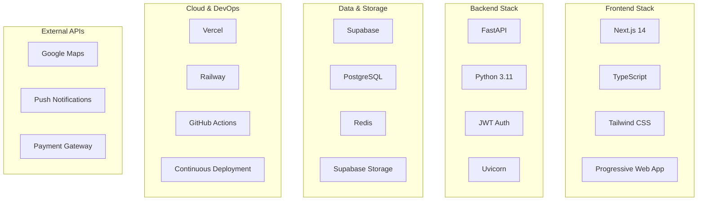

# Stack Tecnológico

## 🛠 Visión General

Dale está construido sobre un **stack tecnológico moderno y probado** que garantiza escalabilidad, mantenibilidad y rendimiento óptimo. Nuestra selección de tecnologías se basa en criterios de:

- ✅ **Performance**: Tecnologías optimizadas para velocidad y eficiencia
- ✅ **Escalabilidad**: Capacidad de crecimiento horizontal y vertical
- ✅ **Mantenibilidad**: Código limpio y fácil de mantener
- ✅ **Comunidad**: Amplia adopción y soporte activo
- ✅ **Productividad**: Herramientas que aceleran el desarrollo



## 🎨 Frontend Stack

### 📱 Next.js 14 + App Router

**¿Por qué Next.js?**

- ✅ **Performance**: Automatic code splitting y optimization
- ✅ **SEO**: Server-side rendering y static generation
- ✅ **Developer Experience**: Hot reload y TypeScript nativo
- ✅ **Ecosystem**: Gran cantidad de plugins y integraciones
- ✅ **PWA Support**: Soporte nativo para Progressive Web Apps

**Configuración Actual:**
```javascript
// next.config.js
/** @type {import('next').NextConfig} */
const nextConfig = {
  experimental: {
    appDir: true,
  },
  images: {
    domains: ['supabase.co'],
  },
  env: {
    CUSTOM_KEY: process.env.CUSTOM_KEY,
  },
  async rewrites() {
    return [
      {
        source: '/api/:path*',
        destination: 'https://api.dale-app.com/:path*',
      },
    ];
  },
}
```

### 🔷 TypeScript

**Beneficios de TypeScript en Dale:**

```typescript
// Tipos específicos para la aplicación
interface Ride {
  id: string;
  driver_id: string;
  from_city: string;
  to_city: string;
  date_time: string;
  seats_total: number;
  seats_available: number;
  price: number;
  status: 'active' | 'full' | 'cancelled' | 'completed';
  created_at: string;
}

interface User {
  id: string;
  name: string;
  email: string;
  phone?: string;
  avatar_url?: string;
  rating: number;
  total_rides: number;
}
```

**Configuración:**
```json
// tsconfig.json
{
  "compilerOptions": {
    "target": "ES2022",
    "lib": ["dom", "dom.iterable", "esnext"],
    "allowJs": true,
    "skipLibCheck": true,
    "strict": true,
    "noEmit": true,
    "esModuleInterop": true,
    "module": "esnext",
    "moduleResolution": "bundler",
    "resolveJsonModule": true,
    "isolatedModules": true,
    "jsx": "preserve",
    "incremental": true,
    "plugins": [
      {
        "name": "next"
      }
    ]
  }
}
```

### 🎨 Tailwind CSS

**Sistema de Design en Dale:**

```css
/* Configuración de colores personalizados */
:root {
  --primary: #3b82f6;     /* Blue 500 */
  --secondary: #f97316;   /* Orange 500 */
  --success: #10b981;     /* Emerald 500 */
  --warning: #f59e0b;     /* Amber 500 */
  --error: #ef4444;       /* Red 500 */
}

/* Clases personalizadas */
.btn-primary {
  @apply bg-blue-500 hover:bg-blue-600 text-white font-medium py-2 px-4 rounded-lg transition-colors;
}

.card-ride {
  @apply bg-white rounded-xl shadow-md p-6 border border-gray-100 hover:shadow-lg transition-shadow;
}
```

**Componentes UI Personalizados:**
```typescript
// components/ui/Button.tsx
import { ButtonHTMLAttributes, ReactNode } from 'react';
import { cn } from '@/lib/utils';

interface ButtonProps extends ButtonHTMLAttributes<HTMLButtonElement> {
  children: ReactNode;
  variant?: 'primary' | 'secondary' | 'outline';
  size?: 'sm' | 'md' | 'lg';
}

export const Button = ({ 
  children, 
  variant = 'primary', 
  size = 'md', 
  className, 
  ...props 
}: ButtonProps) => {
  return (
    <button
      className={cn(
        'rounded-lg font-medium transition-colors',
        {
          'bg-blue-500 hover:bg-blue-600 text-white': variant === 'primary',
          'bg-gray-100 hover:bg-gray-200 text-gray-900': variant === 'secondary',
          'border border-gray-300 hover:bg-gray-50 text-gray-700': variant === 'outline',
        },
        {
          'py-1 px-3 text-sm': size === 'sm',
          'py-2 px-4 text-base': size === 'md',
          'py-3 px-6 text-lg': size === 'lg',
        },
        className
      )}
      {...props}
    >
      {children}
    </button>
  );
};
```

### 📲 Progressive Web App (PWA)

**Manifest Configuration:**
```json
{
  "name": "Dale - Carpooling App",
  "short_name": "Dale",
  "description": "Comparte viajes y ahorra en transporte",
  "start_url": "/",
  "display": "standalone",
  "theme_color": "#3b82f6",
  "background_color": "#ffffff",
  "orientation": "portrait",
  "icons": [
    {
      "src": "/icon-192.png",
      "sizes": "192x192",
      "type": "image/png"
    },
    {
      "src": "/icon-512.png",
      "sizes": "512x512",
      "type": "image/png"
    }
  ],
  "categories": ["travel", "transportation", "lifestyle"],
  "screenshots": [
    {
      "src": "/screenshot-mobile.png",
      "sizes": "390x844",
      "type": "image/png"
    }
  ]
}
```

**Service Worker:**
```javascript
// public/sw.js
const CACHE_NAME = 'dale-v1';
const urlsToCache = [
  '/',
  '/static/js/bundle.js',
  '/static/css/main.css',
  '/manifest.json'
];

self.addEventListener('install', (event) => {
  event.waitUntil(
    caches.open(CACHE_NAME)
      .then((cache) => cache.addAll(urlsToCache))
  );
});

self.addEventListener('fetch', (event) => {
  event.respondWith(
    caches.match(event.request)
      .then((response) => {
        return response || fetch(event.request);
      })
  );
});
```

## ⚙️ Backend Stack

### 🐍 FastAPI (Python)

**¿Por qué FastAPI?**

- ✅ **Performance**: Uno de los frameworks Python más rápidos
- ✅ **Type Safety**: Validación automática con Pydantic
- ✅ **Documentation**: OpenAPI/Swagger generado automáticamente
- ✅ **Async Support**: Soporte nativo para programación asíncrona
- ✅ **Modern**: Construido sobre Starlette y Pydantic

**Configuración Principal:**
```python
# main.py
from fastapi import FastAPI, Depends, HTTPException
from fastapi.middleware.cors import CORSMiddleware
from fastapi.middleware.trustedhost import TrustedHostMiddleware
from fastapi.security import HTTPBearer
import uvicorn

app = FastAPI(
    title="Dale API",
    description="API para la plataforma de carpooling Dale",
    version="1.0.0",
    docs_url="/docs",
    redoc_url="/redoc",
    openapi_tags=[
        {"name": "users", "description": "Operaciones de usuarios"},
        {"name": "rides", "description": "Operaciones de viajes"},
        {"name": "bookings", "description": "Operaciones de reservas"},
    ]
)

# CORS middleware
app.add_middleware(
    CORSMiddleware,
    allow_origins=["http://localhost:3000", "https://dale-app.com"],
    allow_credentials=True,
    allow_methods=["*"],
    allow_headers=["*"],
)

# Trusted hosts
app.add_middleware(
    TrustedHostMiddleware, 
    allowed_hosts=["*"]
)

# Security
security = HTTPBearer()
```

### 🔐 Autenticación JWT

**Implementación de Autenticación:**
```python
# auth.py
from jose import JWTError, jwt
from datetime import datetime, timedelta
from typing import Optional

SECRET_KEY = "your-secret-key"
ALGORITHM = "HS256"
ACCESS_TOKEN_EXPIRE_MINUTES = 30

def create_access_token(data: dict, expires_delta: Optional[timedelta] = None):
    to_encode = data.copy()
    if expires_delta:
        expire = datetime.utcnow() + expires_delta
    else:
        expire = datetime.utcnow() + timedelta(minutes=15)
    to_encode.update({"exp": expire})
    encoded_jwt = jwt.encode(to_encode, SECRET_KEY, algorithm=ALGORITHM)
    return encoded_jwt

def verify_token(token: str, credentials_exception):
    try:
        payload = jwt.decode(token, SECRET_KEY, algorithms=[ALGORITHM])
        email: str = payload.get("sub")
        if email is None:
            raise credentials_exception
        return email
    except JWTError:
        raise credentials_exception
```

### 🗄️ Integración con Supabase

**Cliente Supabase:**
```python
# database.py
from supabase import create_client, Client
from typing import List, Optional

supabase_url = "your-supabase-url"
supabase_key = "your-supabase-key"
supabase: Client = create_client(supabase_url, supabase_key)

class RideRepository:
    @staticmethod
    async def create_ride(ride_data: dict) -> dict:
        result = supabase.table('rides').insert(ride_data).execute()
        return result.data[0]
    
    @staticmethod
    async def get_rides(filters: dict) -> List[dict]:
        query = supabase.table('rides').select('*')
        
        if filters.get('from_city'):
            query = query.eq('from_city', filters['from_city'])
        if filters.get('to_city'):
            query = query.eq('to_city', filters['to_city'])
        if filters.get('date'):
            query = query.gte('date_time', filters['date'])
            
        result = query.execute()
        return result.data
    
    @staticmethod
    async def update_ride_seats(ride_id: str, seats_booked: int):
        # Atomic update para evitar race conditions
        result = supabase.rpc(
            'update_ride_seats',
            {
                'ride_id': ride_id,
                'seats_to_book': seats_booked
            }
        ).execute()
        return result.data
```

## 🗄️ Data & Storage Stack

### 🗃️ Supabase

**¿Por qué Supabase?**

- ✅ **PostgreSQL**: Base de datos relacional robusta y potente
- ✅ **Real-time**: Suscripciones en tiempo real out-of-the-box
- ✅ **Auth**: Sistema de autenticación completo
- ✅ **Storage**: Almacenamiento de archivos integrado
- ✅ **API**: Auto-generación de API REST y GraphQL
- ✅ **Security**: Row Level Security (RLS) nativo

**Esquema de Base de Datos:**
```sql
-- Extensión para UUIDs
CREATE EXTENSION IF NOT EXISTS "uuid-ossp";

-- Tabla de usuarios (extensión de auth.users)
CREATE TABLE public.users (
    id UUID REFERENCES auth.users(id) PRIMARY KEY,
    name TEXT NOT NULL,
    phone TEXT,
    avatar_url TEXT,
    rating DECIMAL(3,2) DEFAULT 5.0,
    total_rides INTEGER DEFAULT 0,
    verification_status TEXT DEFAULT 'pending',
    created_at TIMESTAMP WITH TIME ZONE DEFAULT now(),
    updated_at TIMESTAMP WITH TIME ZONE DEFAULT now()
);

-- Tabla de viajes con índices geoespaciales
CREATE TABLE public.rides (
    id UUID DEFAULT gen_random_uuid() PRIMARY KEY,
    driver_id UUID REFERENCES public.users(id) NOT NULL,
    from_city TEXT NOT NULL,
    from_lat DECIMAL(10, 8) NOT NULL,
    from_lon DECIMAL(11, 8) NOT NULL,
    to_city TEXT NOT NULL,
    to_lat DECIMAL(10, 8) NOT NULL,
    to_lon DECIMAL(11, 8) NOT NULL,
    date_time TIMESTAMP WITH TIME ZONE NOT NULL,
    seats_total INTEGER NOT NULL CHECK (seats_total > 0),
    seats_available INTEGER NOT NULL CHECK (seats_available >= 0),
    price DECIMAL(10, 2) NOT NULL CHECK (price >= 0),
    notes TEXT,
    status TEXT NOT NULL DEFAULT 'active' 
        CHECK (status IN ('active', 'full', 'cancelled', 'completed')),
    created_at TIMESTAMP WITH TIME ZONE DEFAULT now(),
    updated_at TIMESTAMP WITH TIME ZONE DEFAULT now()
);

-- Tabla de reservas
CREATE TABLE public.bookings (
    id UUID DEFAULT gen_random_uuid() PRIMARY KEY,
    ride_id UUID REFERENCES public.rides(id) NOT NULL,
    rider_id UUID REFERENCES public.users(id) NOT NULL,
    seats_booked INTEGER NOT NULL CHECK (seats_booked > 0),
    total_price DECIMAL(10, 2) NOT NULL CHECK (total_price >= 0),
    status TEXT NOT NULL DEFAULT 'pending' 
        CHECK (status IN ('pending', 'confirmed', 'cancelled', 'completed')),
    created_at TIMESTAMP WITH TIME ZONE DEFAULT now(),
    updated_at TIMESTAMP WITH TIME ZONE DEFAULT now(),
    UNIQUE(ride_id, rider_id)
);
```

**Row Level Security (RLS):**
```sql
-- Habilitar RLS
ALTER TABLE public.users ENABLE ROW LEVEL SECURITY;
ALTER TABLE public.rides ENABLE ROW LEVEL SECURITY;
ALTER TABLE public.bookings ENABLE ROW LEVEL SECURITY;

-- Políticas para usuarios
CREATE POLICY "Users can view own profile" ON public.users
    FOR SELECT USING (auth.uid() = id);

CREATE POLICY "Users can update own profile" ON public.users
    FOR UPDATE USING (auth.uid() = id);

CREATE POLICY "Users can insert own profile" ON public.users
    FOR INSERT WITH CHECK (auth.uid() = id);

-- Políticas para viajes
CREATE POLICY "Anyone can view active rides" ON public.rides
    FOR SELECT USING (status = 'active');

CREATE POLICY "Users can create rides" ON public.rides
    FOR INSERT WITH CHECK (auth.uid() = driver_id);

CREATE POLICY "Drivers can update own rides" ON public.rides
    FOR UPDATE USING (auth.uid() = driver_id);

-- Políticas para reservas
CREATE POLICY "Users can view own bookings" ON public.bookings
    FOR SELECT USING (auth.uid() = rider_id);

CREATE POLICY "Users can create bookings" ON public.bookings
    FOR INSERT WITH CHECK (auth.uid() = rider_id);

CREATE POLICY "Users can cancel own bookings" ON public.bookings
    FOR UPDATE USING (auth.uid() = rider_id AND status = 'pending');
```

### ⚡ Redis (Caching)

**Uso de Redis en Dale:**
```python
# cache.py
import redis
import json
from typing import Optional

redis_client = redis.Redis(
    host='localhost',
    port=6379,
    db=0,
    decode_responses=True
)

class CacheService:
    @staticmethod
    def get_cached_rides(filters: dict) -> Optional[List[dict]]:
        cache_key = f"rides:{hash(str(filters))}"
        cached_data = redis_client.get(cache_key)
        
        if cached_data:
            return json.loads(cached_data)
        return None
    
    @staticmethod
    def cache_rides(filters: dict, rides: List[dict], ttl: int = 300):
        cache_key = f"rides:{hash(str(filters))}"
        redis_client.setex(
            cache_key, 
            ttl, 
            json.dumps(rides, default=str)
        )
    
    @staticmethod
    def invalidate_rides_cache():
        # Invalidar cache de búsquedas de viajes
        pattern = "rides:*"
        keys = redis_client.keys(pattern)
        if keys:
            redis_client.delete(*keys)
```

## 🌐 Cloud & DevOps

### 🚀 Vercel (Frontend)

**Configuración de Deploy:**
```json
{
  "name": "dale-frontend",
  "version": 2,
  "builds": [
    {
      "src": "package.json",
      "use": "@vercel/next"
    }
  ],
  "routes": [
    {
      "src": "/api/(.*)",
      "dest": "https://api.dale-app.com/$1"
    }
  ],
  "env": {
    "NEXT_PUBLIC_API_BASE_URL": "https://api.dale-app.com",
    "NEXT_PUBLIC_SUPABASE_URL": "@supabase-url",
    "NEXT_PUBLIC_SUPABASE_ANON_KEY": "@supabase-anon-key",
    "NEXT_PUBLIC_GOOGLE_MAPS_API_KEY": "@google-maps-key"
  }
}
```

### 🚂 Railway (Backend)

**Configuración Railway:**
```yaml
# railway.toml
[build]
builder = "NIXPACKS"

[deploy]
startCommand = "uvicorn main:app --host 0.0.0.0 --port $PORT"
healthcheckPath = "/health"
healthcheckTimeout = 300

[env]
PYTHON_VERSION = "3.11"
PORT = 8000

[environments.production]
variables = [
  "SUPABASE_URL=your-supabase-url",
  "SUPABASE_SERVICE_ROLE_KEY=your-supabase-service-role-key"
]
```

### 📊 GitHub Actions (CI/CD)

**Workflow de Deployment:**
```yaml
# .github/workflows/deploy.yml
name: Deploy Dale

on:
  push:
    branches: [main]
  pull_request:
    branches: [main]

jobs:
  test:
    runs-on: ubuntu-latest
    strategy:
      matrix:
        component: [frontend, backend]
    
    steps:
    - uses: actions/checkout@v3
    
    - name: Setup Node.js
      if: matrix.component == 'frontend'
      uses: actions/setup-node@v3
      with:
        node-version: '18'
        cache: 'npm'
        cache-dependency-path: frontend/package-lock.json
    
    - name: Setup Python
      if: matrix.component == 'backend'
      uses: actions/setup-python@v4
      with:
        python-version: '3.11'
        cache: 'pip'
        cache-dependency-path: backend/requirements.txt
    
    - name: Install dependencies
      if: matrix.component == 'frontend'
      run: cd frontend && npm ci
    
    - name: Install Python dependencies
      if: matrix.component == 'backend'
      run: |
        cd backend
        pip install -r requirements.txt
        pip install pytest pytest-cov
    
    - name: Run tests
      if: matrix.component == 'frontend'
      run: cd frontend && npm run test
    
    - name: Run Python tests
      if: matrix.component == 'backend'
      run: |
        cd backend
        pytest --cov=main --cov-report=xml
    
    - name: Upload coverage
      if: matrix.component == 'backend'
      uses: codecov/codecov-action@v3
      with:
        file: ./backend/coverage.xml

  deploy-frontend:
    needs: test
    runs-on: ubuntu-latest
    if: github.ref == 'refs/heads/main'
    
    steps:
    - uses: actions/checkout@v3
    
    - name: Deploy to Vercel
      uses: amondnet/vercel-action@v20
      with:
        vercel-token: ${{ secrets.VERCEL_TOKEN }}
        vercel-org-id: ${{ secrets.ORG_ID }}
        vercel-project-id: ${{ secrets.PROJECT_ID }}
        vercel-args: '--prod'

  deploy-backend:
    needs: test
    runs-on: ubuntu-latest
    if: github.ref == 'refs/heads/main'
    
    steps:
    - uses: actions/checkout@v3
    
    - name: Deploy to Railway
      uses: bervProject/railway-deploy@v1
      with:
        railway_token: ${{ secrets.RAILWAY_TOKEN }}
        service: backend
```

## 🗺️ External APIs

### 🌍 Google Maps Integration

**Configuración de Maps:**
```typescript
// lib/maps.ts
declare global {
  interface Window {
    google: typeof google;
  }
}

export class MapsService {
  private static instance: MapsService;
  private map: google.maps.Map | null = null;
  private directionsService: google.maps.DirectionsService | null = null;
  private directionsRenderer: google.maps.DirectionsRenderer | null = null;

  static getInstance(): MapsService {
    if (!MapsService.instance) {
      MapsService.instance = new MapsService();
    }
    return MapsService.instance;
  }

  async initialize(element: HTMLElement): Promise<void> {
    const { Map } = await google.maps.importLibrary("maps");
    
    this.map = new Map(element, {
      center: { lat: 40.4168, lng: -3.7038 }, // Madrid
      zoom: 10,
      mapTypeControl: false,
      streetViewControl: false,
      fullscreenControl: true,
    });

    this.directionsService = new google.maps.DirectionsService();
    this.directionsRenderer = new google.maps.DirectionsRenderer({
      suppressMarkers: false,
      polylineOptions: {
        strokeColor: '#3b82f6',
        strokeWeight: 4,
      },
    });
    this.directionsRenderer.setMap(this.map);
  }

  async geocodeAddress(address: string): Promise<google.maps.LatLngLiteral | null> {
    const { Geocoder } = await google.maps.importLibrary("geocoding");
    const geocoder = new Geocoder();

    return new Promise((resolve) => {
      geocoder.geocode({ address }, (results, status) => {
        if (status === 'OK' && results?.[0]) {
          resolve(results[0].geometry.location.toJSON());
        } else {
          resolve(null);
        }
      });
    });
  }

  async calculateRoute(
    origin: google.maps.LatLngLiteral,
    destination: google.maps.LatLngLiteral
  ): Promise<google.maps.DirectionsResult | null> {
    if (!this.directionsService || !this.directionsRenderer) {
      return null;
    }

    return new Promise((resolve) => {
      this.directionsService.route(
        {
          origin,
          destination,
          travelMode: google.maps.TravelMode.DRIVING,
        },
        (result, status) => {
          if (status === 'OK' && result) {
            this.directionsRenderer.setDirections(result);
            resolve(result);
          } else {
            resolve(null);
          }
        }
      );
    });
  }

  addRideMarker(
    position: google.maps.LatLngLiteral,
    ride: Ride,
    onClick: (ride: Ride) => void
  ): google.maps.Marker {
    const { AdvancedMarkerElement } = google.maps.importLibrary("marker") as google.maps.MarkerLibrary;
    
    const marker = new AdvancedMarkerElement({
      map: this.map,
      position,
      title: `${ride.from_city} → ${ride.to_city}`,
    });

    marker.addListener('click', () => onClick(ride));

    return marker as google.maps.Marker;
  }
}
```

## 📊 Monitoreo y Analytics

### 📈 Google Analytics 4

**Configuración GA4:**
```typescript
// lib/analytics.ts
declare gtag: Function;

export const GA_TRACKING_ID = process.env.NEXT_PUBLIC_GA_ID;

export const pageview = (url: string) => {
  if (typeof window !== 'undefined' && GA_TRACKING_ID) {
    gtag('config', GA_TRACKING_ID, {
      page_path: url,
    });
  }
};

export const event = (
  action: string,
  category: string,
  label?: string,
  value?: number
) => {
  if (typeof window !== 'undefined' && GA_TRACKING_ID) {
    gtag('event', action, {
      event_category: category,
      event_label: label,
      value: value,
    });
  }
};

// Eventos personalizados para Dale
export const trackRideCreated = (ride: Ride) => {
  event('ride_created', 'rides', `${ride.from_city}_to_${ride.to_city}`, ride.price);
};

export const trackBookingMade = (booking: Booking) => {
  event('booking_made', 'bookings', booking.ride_id, booking.total_price);
};

export const trackUserRegistration = (method: string) => {
  event('sign_up', 'auth', method);
};
```

## 🔧 Herramientas de Desarrollo

### 🐍 Python Tools

**Dependencias del Backend:**
```txt
# requirements.txt
fastapi==0.104.1
uvicorn[standard]==0.24.0
supabase==2.3.0
python-jose[cryptography]==3.3.0
pydantic==2.5.0
python-multipart==0.0.6
redis==5.0.1
httpx==0.25.2
pytest==7.4.3
pytest-asyncio==0.21.1
pytest-cov==4.1.0
black==23.11.0
flake8==6.1.0
mypy==1.7.1
```

**Configuración de Linting:**
```ini
# .flake8
[flake8]
max-line-length = 88
extend-ignore = E203, W503
exclude = 
    .git,
    __pycache__,
    .venv,
    venv,
    *.pyc,
    build,
    dist
```

```toml
# pyproject.toml
[tool.black]
line-length = 88
target-version = ['py311']
include = '\.pyi?$'

[tool.mypy]
python_version = "3.11"
warn_return_any = true
warn_unused_configs = true
disallow_untyped_defs = true

[tool.pytest.ini_options]
testpaths = ["tests"]
addopts = "-v --cov=main --cov-report=term-missing"
```

### ⚛️ Frontend Tools

**Dependencias del Frontend:**
```json
{
  "name": "dale-frontend",
  "version": "1.0.0",
  "private": true,
  "scripts": {
    "dev": "next dev",
    "build": "next build",
    "start": "next start",
    "lint": "next lint",
    "type-check": "tsc --noEmit",
    "test": "jest",
    "test:watch": "jest --watch",
    "test:coverage": "jest --coverage"
  },
  "dependencies": {
    "next": "14.0.3",
    "react": "^18.2.0",
    "react-dom": "^18.2.0",
    "typescript": "^5.3.2",
    "@types/node": "^20.9.0",
    "@types/react": "^18.2.38",
    "@types/react-dom": "^18.2.17",
    "tailwindcss": "^3.3.5",
    "autoprefixer": "^10.4.16",
    "postcss": "^8.4.31",
    "@supabase/supabase-js": "^2.38.4",
    "lucide-react": "^0.294.0",
    "react-hook-form": "^7.48.2",
    "@hookform/resolvers": "^3.3.2",
    "zod": "^3.22.4"
  },
  "devDependencies": {
    "@types/jest": "^29.5.8",
    "jest": "^29.7.0",
    "jest-environment-jsdom": "^29.7.0",
    "@testing-library/react": "^13.4.0",
    "@testing-library/jest-dom": "^6.1.4",
    "eslint": "^8.54.0",
    "eslint-config-next": "14.0.3",
    "prettier": "^3.1.0",
    "prettier-plugin-tailwindcss": "^0.5.7"
  }
}
```

**Configuración de Testing:**
```javascript
// jest.config.js
const nextJest = require('next/jest');

const createJestConfig = nextJest({
  dir: './',
});

const customJestConfig = {
  moduleDirectories: ['node_modules', '<rootDir>/'],
  testEnvironment: 'jest-environment-jsdom',
  setupFilesAfterEnv: ['<rootDir>/jest.setup.js'],
  moduleNameMapping: {
    '^@/(.*)$': '<rootDir>/src/$1',
  },
  testMatch: [
    '**/__tests__/**/*.(test|spec).(js|jsx|ts|tsx)',
    '**/*.(test|spec).(js|jsx|ts|tsx)',
  ],
  collectCoverageFrom: [
    'src/**/*.{js,jsx,ts,tsx}',
    '!src/**/*.d.ts',
    '!src/**/index.ts',
  ],
  coverageThreshold: {
    global: {
      branches: 80,
      functions: 80,
      lines: 80,
      statements: 80,
    },
  },
};

module.exports = createJestConfig(customJestConfig);
```

## 🎯 Decisiones Arquitectónicas

### 🤔 Por qué estas tecnologías?

#### Next.js vs React SPA
- **SEO**: Necesitamos que los viajes sean indexables
- **Performance**: SSG/SSR para mejor carga inicial
- **Developer Experience**: App Router y APIs integradas

#### FastAPI vs Django
- **Performance**: FastAPI es 3x más rápido que Django
- **Type Safety**: Pydantic integration nativa
- **Async**: Soporte nativo para programación asíncrona
- **Documentation**: Auto-generación de OpenAPI/Swagger

#### Supabase vs MongoDB
- **SQL**: Consultas complejas para matching de viajes
- **Real-time**: Websockets para updates en tiempo real
- **Auth**: Sistema completo incluido
- **PostGIS**: Para queries geoespaciales

#### Vercel vs AWS Amplify
- **Performance**: Edge network global
- **DX**: Deploy automático desde Git
- **PWA**: Soporte nativo para Service Workers
- **Simplicity**: Menos configuración que AWS

## 📈 Roadmap Tecnológico

### 🎯 Q1 2026: Optimizaciones
- [ ] **Redis Cluster**: Escalamiento horizontal del cache
- [ ] **CDN**: Distribución global de assets estáticos
- [ ] **Monitoring**: Implementación de APM (Application Performance Monitoring)
- [ ] **Testing**: E2E tests con Playwright

### 🎯 Q2 2026: Nuevas Tecnologías
- [ ] **GraphQL**: API híbrida REST + GraphQL
- [ ] **WebSockets**: Tiempo real para notificaciones
- [ ] **AI/ML**: Recomendaciones inteligentes de viajes
- [ ] **Mobile**: App nativa React Native

### 🎯 Q3 2026: Enterprise Features
- [ ] **Microservices**: Separación completa de servicios
- [ ] **Event Sourcing**: Trazabilidad completa de eventos
- [ ] **Multi-tenancy**: Soporte para múltiples organizaciones
- [ ] **Security**: Zero-trust architecture

### 🎯 Q4 2026: Innovation
- [ ] **Blockchain**: Smart contracts para transparencia
- [ ] **IoT**: Integración con vehículos conectados
- [ ] **AR/VR**: Realidad aumentada para navegación
- [ ] **Voice**: Interfaces de voz para hands-free

---

## 📚 Recursos y Referencias

### 🔗 Documentación Oficial
- [Next.js Documentation](https://nextjs.org/docs)
- [FastAPI Documentation](https://fastapi.tiangolo.com/)
- [Supabase Documentation](https://supabase.com/docs)
- [Tailwind CSS Documentation](https://tailwindcss.com/docs)
- [TypeScript Handbook](https://www.typescriptlang.org/docs/)

### 🎓 Cursos y Tutorials
- [Next.js Full Course](https://www.youtube.com/watch?v=mTz0GXj8NNe)
- [FastAPI Tutorial](https://fastapi.tiangolo.com/tutorial/)
- [Supabase Crash Course](https://www.youtube.com/watch?v=7uKQBl9uZ00)
- [Tailwind CSS Mastery](https://www.youtube.com/watch?v=qr7vqA9s6ug)

### 🛠️ Herramientas Adicionales
- [Vercel CLI](https://vercel.com/cli)
- [Railway CLI](https://railway.app/cli)
- [Supabase CLI](https://supabase.com/docs/guides/cli)
- [GitHub CLI](https://cli.github.com/)

### 📊 Benchmarks y Comparativas
- [FastAPI vs Django Performance](https://fastapi.tiangolo.com/benchmarks/)
- [Next.js Performance Guide](https://nextjs.org/learn/foundations/next-js)
- [PostgreSQL vs MongoDB](https://supabase.com/docs/guides/getting-started/frequently-asked-questions#how-do-i-migrate-from-mongodb-to-postgresql)

---

> **"El mejor stack tecnológico es aquel que permite construir valor rápidamente mientras mantiene la flexibilidad para evolucionar."** - Equipo Dale