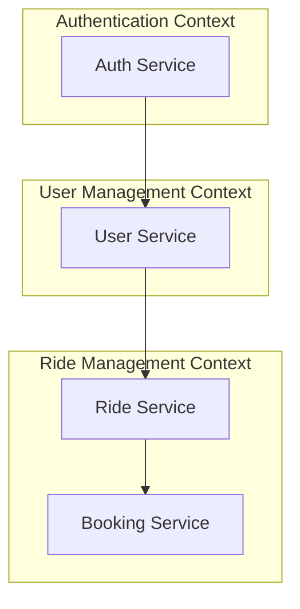

# Principios SDD

## 🎯 Visión General

**Software Design & Development (SDD)** es la filosofía fundamental que guía el desarrollo de Dale. Este enfoque combina las mejores prácticas de Domain-Driven Design (DDD), Clean Architecture y metodologías ágiles para crear software robusto, mantenible y escalable.

## 🌟 Principios Fundamentales

### 1. 🏗️ Domain-Driven Design (DDD)

#### Dominios Principales

Dale se estructura en dominios claramente definidos:

```
dale-app/
├── auth-domain/          # Dominio de Autenticación
├── user-domain/          # Dominio de Usuarios  
├── ride-domain/          # Dominio de Viajes
├── booking-domain/       # Dominio de Reservas
├── notification-domain/  # Dominio de Notificaciones
└── payment-domain/       # Dominio de Pagos (futuro)
```

#### Ubiquitous Language

Un lenguaje común usado por todo el equipo:

```typescript
// Contexto: Viaje de Carpooling
interface Ride {
  id: string;
  driver: User;                    // Conductor
  passengers: User[];             // Pasajeros
  from: Location;                 // Origen
  to: Location;                   // Destino  
  departureTime: DateTime;        // Hora de salida
  availableSeats: number;         // Asientos disponibles
  pricePerSeat: Money;            // Precio por asiento
  status: RideStatus;             // Estado del viaje
}

// Contexto: Reserva
interface Booking {
  id: string;
  ride: Ride;                     // Viaje reservado
  passenger: User;                // Pasajero
  seatsReserved: number;          // Asientos reservados
  totalPrice: Money;              // Precio total
  status: BookingStatus;          // Estado de la reserva
}
```

#### Bounded Contexts

Separación clara de contextos:



### 2. 🧼 Clean Architecture

#### Capas de la Arquitectura

```python
# Estructura de capas
app/
├── domain/               # Core business logic
│   ├── entities/         # Business entities
│   ├── value_objects/    # Immutable objects
│   ├── domain_services/  # Business rules
│   └── repositories/     # Abstract repositories
├── application/          # Use cases
│   ├── use_cases/        # Application logic
│   ├── interfaces/       # Input/output ports
│   └── services/         # Application services
├── infrastructure/       # External concerns
│   ├── persistence/      # Database implementations
│   ├── external_apis/    # Third-party APIs
│   └── ui/              # User interface
└── interfaces/          # Input/output adapters
    ├── http/            # HTTP controllers
    ├── cli/             # Command line
    └── websocket/       # Real-time events
```

#### Dependency Rule

```python
# dependency-inversion.py
from abc import ABC, abstractmethod
from typing import List

# Core domain interface (dependido por Application)
class RideRepository(ABC):
    @abstractmethod
    async def save(self, ride: Ride) -> Ride:
        pass
    
    @abstractmethod
    async def find_by_id(self, ride_id: str) -> Ride:
        pass
    
    @abstractmethod
    async def search(self, filters: dict) -> List[Ride]:
        pass

# Infrastructure implementation
class SupabaseRideRepository(RideRepository):
    async def save(self, ride: Ride) -> Ride:
        # Implementación específica de Supabase
        return ride
    
    async def find_by_id(self, ride_id: str) -> Ride:
        # Lógica de búsqueda
        return ride
    
    async def search(self, filters: dict) -> List[Ride]:
        # Lógica de búsqueda con filtros
        return []

# Application layer (depende de abstracciones)
class CreateRideUseCase:
    def __init__(self, ride_repo: RideRepository):
        self.ride_repo = ride_repo  # Depende de abstracción
    
    async def execute(self, ride_data: CreateRideDTO) -> Ride:
        # Lógica de negocio
        ride = Ride.create(ride_data)
        return await self.ride_repo.save(ride)
```

### 3. 🔄 SOLID Principles

#### Single Responsibility Principle (SRP)

```typescript
// ❌ Violación SRP - Demasiadas responsabilidades
class UserService {
    async createUser(data: CreateUserDTO): Promise<User> {
        // Validación
        // Persistencia
        // Envío de email
        // Notificación
        // Logging
    }
}

// ✅ Cumplimiento SRP - Una responsabilidad por clase
class UserCreator {
    constructor(
        private userRepository: UserRepository,
        private userValidator: UserValidator,
        private eventBus: EventBus
    ) {}
    
    async create(data: CreateUserDTO): Promise<User> {
        this.userValidator.validate(data);
        const user = await this.userRepository.save(data);
        this.eventBus.publish(new UserCreatedEvent(user));
        return user;
    }
}

class EmailNotificationService {
    constructor(private emailProvider: EmailProvider) {}
    
    async sendWelcomeEmail(user: User): Promise<void> {
        await this.emailProvider.send({
            to: user.email,
            template: 'welcome',
            data: { user }
        });
    }
}
```

#### Open/Closed Principle (OCP)

```typescript
// ✅ Extensible sin modificar código existente
interface RidePricingStrategy {
    calculatePrice(basePrice: number, context: PricingContext): number;
}

class StandardPricingStrategy implements RidePricingStrategy {
    calculatePrice(basePrice: number): number {
        return basePrice;
    }
}

class WeekendPricingStrategy implements RidePricingStrategy {
    calculatePrice(basePrice: number, context: PricingContext): number {
        return context.isWeekend ? basePrice * 1.2 : basePrice;
    }
}

class PeakHourPricingStrategy implements RidePricingStrategy {
    calculatePrice(basePrice: number, context: PricingContext): number {
        return context.isPeakHour ? basePrice * 1.5 : basePrice;
    }
}

// Context para determinar estrategia
class PricingContext {
    constructor(
        public isWeekend: boolean,
        public isPeakHour: boolean,
        public demandLevel: 'low' | 'medium' | 'high'
    ) {}
}

class PricingEngine {
    constructor(private strategies: Map<string, RidePricingStrategy>) {}
    
    getPrice(basePrice: number, strategyName: string, context: PricingContext): number {
        const strategy = this.strategies.get(strategyName);
        if (!strategy) throw new Error(`Strategy ${strategyName} not found`);
        return strategy.calculatePrice(basePrice, context);
    }
}
```

### 4. 🎯 Test-Driven Development (TDD)

#### Red-Green-Refactor Cycle

```typescript
// 🔴 RED - Test que falla
describe('RideService', () => {
    it('should create a ride with available seats', async () => {
        // Arrange
        const rideData = {
            driverId: 'driver-123',
            from: 'Madrid',
            to: 'Barcelona',
            seatsTotal: 3,
            pricePerSeat: 25
        };
        
        // Act
        const ride = await rideService.createRide(rideData);
        
        // Assert
        expect(ride.availableSeats).toBe(3);
        expect(ride.status).toBe('active');
    });
});

// ✅ GREEN - Implementación mínima
class RideService {
    async createRide(data: CreateRideDTO): Promise<Ride> {
        const ride = new Ride({
            ...data,
            availableSeats: data.seatsTotal,
            status: 'active'
        });
        return await this.rideRepository.save(ride);
    }
}

// 🔄 REFACTOR - Mejoras
class RideService {
    constructor(
        private rideRepository: RideRepository,
        private pricingEngine: PricingEngine,
        private eventBus: EventBus
    ) {}
    
    async createRide(data: CreateRideDTO): Promise<Ride> {
        // Validaciones de negocio
        this.validateRideData(data);
        
        // Calcular precio final
        const finalPrice = this.pricingEngine.calculatePrice(data.pricePerSeat, {
            isWeekend: this.isWeekend(data.departureTime),
            demandLevel: this.getDemandLevel(data.from, data.to)
        });
        
        const ride = new Ride({
            ...data,
            pricePerSeat: finalPrice,
            availableSeats: data.seatsTotal,
            status: 'active'
        });
        
        const savedRide = await this.rideRepository.save(ride);
        
        // Publicar evento
        this.eventBus.publish(new RideCreatedEvent(savedRide));
        
        return savedRide;
    }
    
    private validateRideData(data: CreateRideDTO): void {
        if (data.seatsTotal <= 0) {
            throw new ValidationError('Seats total must be positive');
        }
        if (data.pricePerSeat <= 0) {
            throw new ValidationError('Price per seat must be positive');
        }
    }
}
```

### 5. 🔒 Security by Design

#### Security Principles

```typescript
// Principle of Least Privilege
class RideAccessController {
    canAccessRide(userId: string, rideId: string, action: RideAction): boolean {
        const ride = this.rideRepository.findById(rideId);
        
        switch (action) {
            case 'view':
                return ride.status === 'active' || 
                       ride.driverId === userId ||
                       this.isPassenger(userId, rideId);
                       
            case 'modify':
                return ride.driverId === userId;
                
            case 'book':
                return ride.status === 'active' && 
                       ride.driverId !== userId &&
                       this.isAvailable(rideId);
                       
            case 'cancel':
                return ride.driverId === userId || 
                       this.isPassenger(userId, rideId);
        }
    }
}

// Defense in Depth
class SecureRideService {
    async createRide(data: CreateRideDTO, userId: string): Promise<Ride> {
        // 1. Authentication
        this.authService.requireAuth(userId);
        
        // 2. Authorization
        if (!this.permissions.canCreateRide(userId)) {
            throw new ForbiddenError('Cannot create rides');
        }
        
        // 3. Input Validation
        this.validator.validate(data);
        
        // 4. Rate Limiting
        await this.rateLimiter.checkLimit(userId, 'create_ride');
        
        // 5. Business Logic
        const ride = await this.rideService.createRide(data, userId);
        
        // 6. Audit Logging
        this.auditLogger.log({
            userId,
            action: 'ride_created',
            resourceId: ride.id,
            timestamp: new Date()
        });
        
        return ride;
    }
}
```

### 6. 📊 Observable Design

#### Monitoring and Logging

```typescript
// Structured Logging
class RideService {
    private logger = new Logger('RideService');
    
    async createRide(data: CreateRideDTO, userId: string): Promise<Ride> {
        const correlationId = this.generateCorrelationId();
        
        this.logger.info('Creating ride', {
            correlationId,
            userId,
            from: data.from,
            to: data.to
        });
        
        try {
            const ride = await this.rideRepository.save(data);
            
            this.logger.info('Ride created successfully', {
                correlationId,
                rideId: ride.id
            });
            
            // Metrics
            this.metrics.increment('rides.created');
            this.metrics.histogram('ride.creation.duration', duration);
            
            return ride;
        } catch (error) {
            this.logger.error('Failed to create ride', {
                correlationId,
                error: error.message,
                stack: error.stack
            });
            
            this.metrics.increment('rides.creation_failed');
            throw error;
        }
    }
}

// Health Checks
class RideHealthChecker implements HealthChecker {
    async check(): Promise<HealthStatus> {
        const checks = await Promise.allSettled([
            this.checkDatabase(),
            this.checkExternalAPIs(),
            this.checkBusinessLogic()
        ]);
        
        return {
            status: checks.every(c => c.status === 'fulfilled') ? 'healthy' : 'unhealthy',
            details: checks.map((check, i) => ({
                name: ['database', 'external_apis', 'business_logic'][i],
                status: check.status,
                message: check.status === 'rejected' ? check.reason.message : 'OK'
            }))
        };
    }
}
```

## 🏗️ Architecture Patterns

### 1. 📦 Module Pattern

```typescript
// Ride Module - Cohesión alta
export interface RideModule {
    // Services
    rideService: RideService;
    bookingService: BookingService;
    
    // Repositories
    rideRepository: RideRepository;
    bookingRepository: BookingRepository;
    
    // Events
    onRideCreated: EventHandler<RideCreatedEvent>;
    onRideCancelled: EventHandler<RideCancelledEvent>;
}

// Module Implementation
class RideModuleImpl implements RideModule {
    public rideService: RideService;
    public bookingService: BookingService;
    public rideRepository: RideRepository;
    public bookingRepository: BookingRepository;
    
    constructor(
        database: Database,
        eventBus: EventBus,
        externalServices: ExternalServices
    ) {
        // Wire dependencies
        this.rideRepository = new SupabaseRideRepository(database);
        this.bookingRepository = new SupabaseBookingRepository(database);
        
        this.rideService = new RideService(
            this.rideRepository,
            this.bookingRepository,
            eventBus
        );
        
        this.bookingService = new BookingService(
            this.bookingRepository,
            this.rideRepository,
            eventBus
        );
        
        // Register event handlers
        this.registerEventHandlers(eventBus);
    }
    
    private registerEventHandlers(eventBus: EventBus): void {
        this.onRideCreated = async (event: RideCreatedEvent) => {
            // Handle ride creation
        };
        
        this.onRideCancelled = async (event: RideCancelledEvent) => {
            // Handle ride cancellation
        };
        
        eventBus.register('ride.created', this.onRideCreated);
        eventBus.register('ride.cancelled', this.onRideCancelled);
    }
}
```

### 2. 🔄 Event-Driven Architecture

```typescript
// Domain Events
abstract class DomainEvent {
    constructor(
        public aggregateId: string,
        public occurredAt: Date,
        public version: number = 1
    ) {}
}

class RideCreatedEvent extends DomainEvent {
    constructor(
        aggregateId: string,
        public driverId: string,
        public from: string,
        public to: string,
        public departureTime: Date,
        public pricePerSeat: number
    ) {
        super(aggregateId, new Date());
    }
}

class BookingConfirmedEvent extends DomainEvent {
    constructor(
        aggregateId: string,
        public bookingId: string,
        public passengerId: string,
        public seatsBooked: number
    ) {
        super(aggregateId, new Date());
    }
}

// Event Store
interface EventStore {
    append(events: DomainEvent[]): Promise<void>;
    load(aggregateId: string): Promise<DomainEvent[]>;
    getEvents(since?: Date): AsyncIterable<DomainEvent>;
}

// Event Handlers
class RideEventHandler {
    constructor(
        private notificationService: NotificationService,
        private emailService: EmailService
    ) {}
    
    async handleRideCreated(event: RideCreatedEvent): Promise<void> {
        // Notify driver
        await this.notificationService.notifyDriver(event.driverId, {
            type: 'ride_created',
            message: `Tu viaje de ${event.from} a ${event.to} ha sido creado`,
            data: { rideId: event.aggregateId }
        });
        
        // Send confirmation email
        await this.emailService.sendDriverConfirmation(event.driverId, {
            from: event.from,
            to: event.to,
            departureTime: event.departureTime,
            pricePerSeat: event.pricePerSeat
        });
    }
    
    async handleBookingConfirmed(event: BookingConfirmedEvent): Promise<void> {
        // Get ride details
        const ride = await this.rideRepository.findById(event.aggregateId);
        
        // Notify passengers of new booking
        await this.notificationService.notifyPassengers(ride.passengerIds, {
            type: 'booking_confirmed',
            message: `Nueva reserva en tu viaje ${ride.from} → ${ride.to}`,
            data: { 
                bookingId: event.bookingId,
                seatsBooked: event.seatsBooked
            }
        });
    }
}
```

### 3. 🏛️ CQRS Pattern

```typescript
// Command Side - Writes
interface CreateRideCommand {
    driverId: string;
    from: Location;
    to: Location;
    departureTime: Date;
    seatsTotal: number;
    pricePerSeat: number;
    notes?: string;
}

class CreateRideCommandHandler {
    constructor(
        private rideRepository: RideWriteRepository,
        private eventStore: EventStore,
        private validator: CommandValidator
    ) {}
    
    async handle(command: CreateRideCommand): Promise<Result<RideId>> {
        // 1. Validate command
        await this.validator.validate(command);
        
        // 2. Create aggregate
        const ride = Ride.create(command);
        
        // 3. Save to write database
        await this.rideRepository.save(ride);
        
        // 4. Save events
        await this.eventStore.append(ride.getUncommittedEvents());
        
        // 5. Mark events as committed
        ride.markEventsAsCommitted();
        
        return Result.success(ride.id);
    }
}

// Query Side - Reads
interface RideSearchQuery {
    from?: string;
    to?: string;
    date?: Date;
    maxPrice?: number;
    seatsNeeded?: number;
    page?: number;
    limit?: number;
}

interface RideSearchResult {
    rides: RideSearchItem[];
    total: number;
    page: number;
    limit: number;
}

class RideQueryHandler {
    constructor(
        private rideReadRepository: RideReadRepository,
        private searchEngine: SearchEngine
    ) {}
    
    async handle(query: RideSearchQuery): Promise<RideSearchResult> {
        // Use read model optimized for queries
        const results = await this.searchEngine.search(query);
        
        // Map to DTOs
        const rides = results.map(this.mapToRideSearchItem);
        
        return {
            rides,
            total: results.total,
            page: query.page || 1,
            limit: query.limit || 20
        };
    }
    
    private mapToRideSearchItem(ride: RideReadModel): RideSearchItem {
        return {
            id: ride.id,
            driver: {
                name: ride.driverName,
                rating: ride.driverRating,
                photo: ride.driverPhoto
            },
            from: ride.from,
            to: ride.to,
            departureTime: ride.departureTime,
            availableSeats: ride.availableSeats,
            pricePerSeat: ride.pricePerSeat,
            status: ride.status
        };
    }
}
```

## 🎯 Design Guidelines

### 1. 📐 Code Organization

```typescript
// Estructura de archivos por feature
src/
├── features/
│   ├── rides/
│   │   ├── domain/
│   │   │   ├── entities/
│   │   │   │   ├── Ride.ts
│   │   │   │   └── RideStatus.ts
│   │   │   ├── value-objects/
│   │   │   │   ├── Location.ts
│   │   │   │   └── Money.ts
│   │   │   └── services/
│   │   │       └── RideDomainService.ts
│   │   ├── application/
│   │   │   ├── commands/
│   │   │   │   ├── CreateRideCommand.ts
│   │   │   │   └── CreateRideHandler.ts
│   │   │   ├── queries/
│   │   │   │   ├── SearchRidesQuery.ts
│   │   │   │   └── SearchRidesHandler.ts
│   │   │   └── services/
│   │   │       └── RideApplicationService.ts
│   │   ├── infrastructure/
│   │   │   ├── persistence/
│   │   │   │   └── RideRepositoryImpl.ts
│   │   │   ├── external/
│   │   │   │   └── MapsServiceImpl.ts
│   │   │   └── controllers/
│   │   │       └── RideController.ts
│   │   └── tests/
│   │       ├── unit/
│   │       ├── integration/
│   │       └── e2e/
│   └── users/
│       └── ...
```

### 2. 🎨 Naming Conventions

```typescript
// ✅ Buenos nombres - Descriptivos y claros
class RideBookingService {}
interface CreateRideRequest {}
interface RideSearchFilters {}

// ❌ Malos nombres - Vagos o confusos
class Service1 {}
interface Request {}
interface Filters {}

// ✅ Valores enumerados claros
enum RideStatus {
    DRAFT = 'draft',
    ACTIVE = 'active',
    FULL = 'full',
    CANCELLED = 'cancelled',
    COMPLETED = 'completed'
}

// ✅ Métodos que indican intención
class RideService {
    async createDraftRide(data: CreateRideData): Promise<Ride>
    async publishRide(rideId: string): Promise<Ride>
    async cancelRide(rideId: string, reason: string): Promise<Ride>
    async completeRide(rideId: string): Promise<Ride>
}
```

### 3. 📝 Documentation Standards

```typescript
/**
 * Representa un viaje de carpooling en el sistema.
 * 
 * Un viaje es creado por un conductor y puede ser reservado
 * por múltiples pasajeros hasta que se llenen todos los asientos.
 * 
 * @example
 * ```typescript
 * const ride = Ride.create({
 *   driverId: 'driver-123',
 *   from: { city: 'Madrid', lat: 40.4168, lng: -3.7038 },
 *   to: { city: 'Barcelona', lat: 41.3851, lng: 2.1734 },
 *   departureTime: new Date('2025-11-15T10:00:00Z'),
 *   seatsTotal: 3,
 *   pricePerSeat: 25.00
 * });
 * ```
 */
class Ride {
    private constructor(
        private readonly id: string,
        private driverId: string,
        private from: Location,
        private to: Location,
        private departureTime: DateTime,
        private seatsTotal: number,
        private availableSeats: number,
        private pricePerSeat: Money,
        private status: RideStatus,
        private notes?: string
    ) {}
    
    /**
     * Crea un nuevo viaje con los datos proporcionados.
     * 
     * @param data - Los datos necesarios para crear el viaje
     * @returns Una nueva instancia de Ride
     * @throws {ValidationError} Si los datos son inválidos
     * @throws {BusinessRuleError} Si se violan reglas de negocio
     */
    static create(data: CreateRideData): Ride {
        // Validaciones...
        // Lógica de negocio...
        // Creación del objeto...
    }
    
    /**
     * Reserva asientos en el viaje.
     * 
     * @param seatsToBook - Número de asientos a reservar
     * @param passengerId - ID del pasajero
     * @returns Resultado de la operación
     * 
     * @example
     * ```typescript
     * const result = ride.bookSeats(2, 'passenger-456');
     * if (result.isSuccess) {
     *   console.log('Reserva exitosa');
     * }
     * ```
     */
    bookSeats(seatsToBook: number, passengerId: string): Result<Booking> {
        // Lógica de reserva...
    }
}
```

## 🚀 Implementation Guidelines

### 1. 🔄 Error Handling

```typescript
// Result pattern para manejo de errores
interface Result<T> {
    isSuccess: boolean;
    isFailure: boolean;
    value?: T;
    error?: Error;
}

class Result<T> {
    private constructor(
        private readonly _isSuccess: boolean,
        private readonly _value?: T,
        private readonly _error?: Error
    ) {}
    
    static success<T>(value: T): Result<T> {
        return new Result<T>(true, value);
    }
    
    static failure<T>(error: Error): Result<T> {
        return new Result<T>(false, undefined, error);
    }
    
    getValue(): T {
        if (!this._isSuccess) {
            throw new Error('Cannot get value from failed result');
        }
        return this._value!;
    }
}

// Uso en servicios
class RideService {
    async createRide(data: CreateRideData): Promise<Result<Ride>> {
        try {
            // Validaciones
            this.validateData(data);
            
            // Lógica de negocio
            const ride = Ride.create(data);
            
            // Persistencia
            await this.rideRepository.save(ride);
            
            return Result.success(ride);
        } catch (error) {
            return Result.failure(error);
        }
    }
}

// Controller handleando resultados
@Controller('/rides')
class RideController {
    @Post()
    async createRide(@Body() data: CreateRideData): Promise<ApiResponse<Ride>> {
        const result = await this.rideService.createRide(data);
        
        if (result.isSuccess) {
            return ApiResponse.success(result.getValue());
        } else {
            return ApiResponse.error(result.error!);
        }
    }
}
```

### 2. 🎯 Validation Strategy

```typescript
// Validator por capa
class CreateRideValidator {
    private rules: ValidationRule[] = [
        new RequiredFieldRule('driverId'),
        new RequiredFieldRule('from'),
        new RequiredFieldRule('to'),
        new RequiredFieldRule('departureTime'),
        new RequiredFieldRule('seatsTotal'),
        new RequiredFieldRule('pricePerSeat'),
        new PositiveNumberRule('seatsTotal'),
        new PositiveNumberRule('pricePerSeat'),
        new FutureDateRule('departureTime'),
        new MaxSeatsRule('seatsTotal', 8),
        new ReasonablePriceRule('pricePerSeat')
    ];
    
    validate(data: CreateRideData): ValidationResult {
        const errors: ValidationError[] = [];
        
        for (const rule of this.rules) {
            const result = rule.validate(data);
            errors.push(...result.errors);
        }
        
        return new ValidationResult(errors);
    }
}

// Context-aware validation
class BookingValidator {
    validate(data: CreateBookingData, context: BookingContext): ValidationResult {
        const errors: ValidationError[] = [];
        
        // Validaciones básicas
        errors.push(...this.validateBasicFields(data));
        
        // Validaciones de contexto
        if (context.rideStatus !== 'active') {
            errors.push(new ValidationError('ride', 'Ride is not active'));
        }
        
        if (context.availableSeats < data.seatsRequested) {
            errors.push(new ValidationError('seats', 'Not enough seats available'));
        }
        
        if (context.passengerHasActiveBooking) {
            errors.push(new ValidationError('passenger', 'User already has booking for this ride'));
        }
        
        return new ValidationResult(errors);
    }
}
```

### 3. 📊 Performance Considerations

```typescript
// Optimización con caching
class CachedRideService implements RideService {
    constructor(
        private rideService: RideService,
        private cache: Cache,
        private cacheStrategy: CacheStrategy
    ) {}
    
    async createRide(data: CreateRideData): Promise<Result<Ride>> {
        const result = await this.rideService.createRide(data);
        
        if (result.isSuccess) {
            // Invalidar cache relevante
            await this.cacheStrategy.invalidateRelatedCaches(result.getValue());
        }
        
        return result;
    }
    
    async searchRides(filters: RideFilters): Promise<Result<RideSearchResult>> {
        const cacheKey = this.cacheStrategy.generateKey('search', filters);
        
        const cached = await this.cache.get<RideSearchResult>(cacheKey);
        if (cached) {
            return Result.success(cached);
        }
        
        const result = await this.rideService.searchRides(filters);
        
        if (result.isSuccess) {
            await this.cache.set(
                cacheKey, 
                result.getValue(), 
                this.cacheStrategy.getTTL('search')
            );
        }
        
        return result;
    }
}

// Pagination con eficiencia
class PaginatedRideRepository implements RideRepository {
    async search(filters: RideFilters, pagination: Pagination): Promise<RideSearchResult> {
        // Usar índices en la base de datos
        const query = this.buildOptimizedQuery(filters, pagination);
        
        // Ejecutar consulta paginada
        const [rides, total] = await Promise.all([
            this.database.query<Ride>('rides', query, pagination),
            this.database.count('rides', this.buildCountQuery(filters))
        ]);
        
        return new RideSearchResult(
            rides,
            total,
            pagination.page,
            pagination.limit
        );
    }
    
    private buildOptimizedQuery(filters: RideFilters, pagination: Pagination): Query {
        return {
            where: {
                status: 'active',
                date_time: { gte: filters.dateFrom, lte: filters.dateTo },
                from_city: filters.from ? { ilike: `%${filters.from}%` } : undefined,
                to_city: filters.to ? { ilike: `%${filters.to}%` } : undefined,
                price: filters.maxPrice ? { lte: filters.maxPrice } : undefined
            },
            orderBy: [
                { field: 'date_time', direction: 'asc' },
                { field: 'price', direction: 'asc' }
            ],
            limit: pagination.limit,
            offset: (pagination.page - 1) * pagination.limit,
            // Usar índices específicos
            index: 'rides_date_time_status_idx'
        };
    }
}
```

## ✅ Checklist de Principios SDD

Para asegurar que el código sigue los principios SDD:

### 🏗️ Arquitectura
- [ ] ✅ **Separación clara** entre capas (domain, application, infrastructure)
- [ ] ✅ **Dependency Rule** respetada en toda la aplicación
- [ ] ✅ **Bounded Contexts** bien definidos y separados
- [ ] ✅ **Modules** cohesivos y con responsabilidades claras

### 🧪 Calidad del Código
- [ ] ✅ **Single Responsibility** aplicada en clases y métodos
- [ ] ✅ **Open/Closed** cumplido para extensibilidad
- [ ] ✅ **Liskov Substitution** respetada en herencia
- [ ] ✅ **Interface Segregation** aplicada en interfaces
- [ ] ✅ **Dependency Inversion** implementada correctamente

### 🔒 Seguridad
- [ ] ✅ **Security by Design** aplicada desde el diseño
- [ ] ✅ **Principle of Least Privilege** implementado
- [ ] ✅ **Defense in Depth** en todas las capas
- [ ] ✅ **Input Validation** en todos los puntos de entrada

### 📊 Observabilidad
- [ ] ✅ **Structured Logging** implementado
- [ ] ✅ **Health Checks** configurados
- [ ] ✅ **Metrics** recopiladas y monitoreadas
- [ ] ✅ **Distributed Tracing** para servicios múltiples

### 🧪 Testing
- [ ] ✅ **TDD** practicado en desarrollo de nuevas features
- [ ] ✅ **Test Pyramid** respetada (más unit que integration que e2e)
- [ ] ✅ **Test Coverage** mantiene altos niveles
- [ ] ✅ **Test Isolation** entre test suites

### 📝 Documentación
- [ ] ✅ **Code Comments** claros y útiles
- [ ] ✅ **API Documentation** actualizada
- [ ] ✅ **Architecture Decision Records** documentadas
- [ ] ✅ **Domain Language** consistente en toda la codebase

## 🎯 Próximos Pasos

Para profundizar en la implementación:

1. **📋 [Metodología](methodology.md)** - Proceso de desarrollo SDD
2. **🎯 [Casos de Uso](use-cases.md)** - Ejemplos prácticos de aplicación
3. **🔧 [Development Guidelines](../development/)** - Guías de implementación
4. **🧪 [Testing Strategy](../development/testing.md)** - Estrategia de testing

---

## 📚 Referencias

- [Domain-Driven Design by Eric Evans](https://www.domainlanguage.com/ddd/)
- [Clean Architecture by Robert Martin](https://8thlight.com/blog/robert-martin/2016/09/01/Clean-Architecture.html)
- [Implementing Domain-Driven Design by Vaughn Vernon](https://vaughnvernon.co/?page_id=130)
- [Test Driven Development by Kent Beck](https://www.kentbeck.com/)

---

> **🎯 Tip**: Los principios SDD no son solo teoría, son herramientas prácticas para crear software mejor. Aplica estos principios gradualmente y verás mejoras significativas en la calidad y mantenibilidad del código. ¡Happy designing! 🏗️