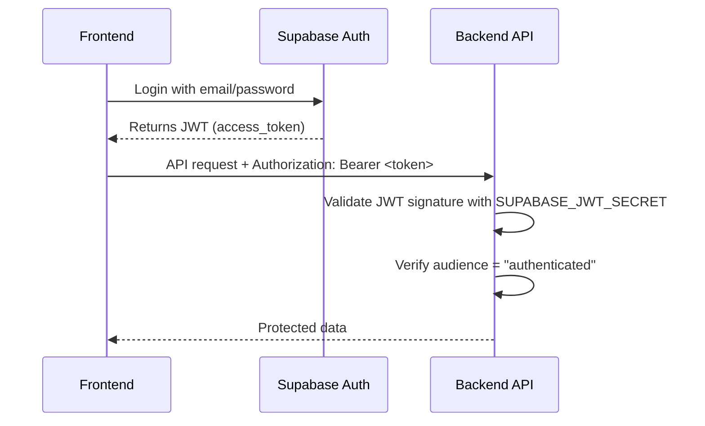

# Backend Architecture Documentation

**Last Updated:** 2026-01-07

---

## Critical Discovery: Two Entry Points

> [!CAUTION]
> The backend has **TWO main.py files**. Running the wrong one causes silent
> failures.

| File                  | Size | Architecture                 | Status                |
| --------------------- | ---- | ---------------------------- | --------------------- |
| `backend/main.py`     | 13KB | Monolith (all routes inline) | **Currently Running** |
| `backend/app/main.py` | 4KB  | Modular (imports routers)    | **Recommended**       |

### How to Run Each

```bash
# CURRENT (Monolith) - what we've been running
cd backend && uvicorn main:app --reload

# RECOMMENDED (Modular) - proper architecture
cd backend && uvicorn app.main:app --reload
```

---

## Directory Structure

```
backend/
├── main.py                 # ⚠️ MONOLITH (13KB) - duplicates all code inline
├── .env                    # Environment variables
├── requirements.txt        # Python dependencies
├── API_DOCS.md             # API documentation
│
└── app/                    # ✅ MODULAR STRUCTURE
    ├── main.py             # Entry point (imports routers)
    ├── middleware/
    │   └── auth.py         # JWT validation with audience check
    ├── models/
    │   └── schemas.py      # Pydantic models (UserBase, RideCreate, etc.)
    ├── routes/
    │   ├── users.py        # /api/me, /api/users/{id}
    │   ├── rides.py        # /api/rides/* endpoints
    │   └── bookings.py     # /api/bookings/* endpoints
    └── utils/
        └── database.py     # Supabase client singleton
```

---

## Database Schema (Supabase)

> [!IMPORTANT]
> Table names are **PascalCase**, not snake_case.

| Table     | Description                                               |
| --------- | --------------------------------------------------------- |
| `User`    | User profiles (synced from Supabase Auth)                 |
| `Ride`    | Published rides with driver_id FK to User                 |
| `Booking` | Reservations with ride_id FK to Ride, rider_id FK to User |

### Foreign Key Relations

```
Ride.driver_id  → User.id
Booking.ride_id → Ride.id
Booking.rider_id → User.id
```

---

## Environment Variables

Required in `backend/.env`:

```bash
SUPABASE_URL=https://your-project.supabase.co
SUPABASE_SERVICE_ROLE_KEY=your-service-role-key
SUPABASE_JWT_SECRET=your-jwt-secret  # CRITICAL: Must match Supabase Dashboard
```

### Where to Find JWT Secret

1. Go to **Supabase Dashboard** → **Settings** → **API**
2. Scroll to **JWT Settings**
3. Copy the **JWT Secret** value exactly

---

## Authentication Flow



### Key Auth Files

| File                                                                                                     | Responsibility                                |
| -------------------------------------------------------------------------------------------------------- | --------------------------------------------- |
| [auth.py](file:///home/anarculture/Downloads/DALE3/dale-v.3.0/backend/app/middleware/auth.py)            | JWT validation, `get_current_user` dependency |
| [schemas.py](file:///home/anarculture/Downloads/DALE3/dale-v.3.0/backend/app/models/schemas.py#L112-118) | `TokenPayload` model for decoded JWT          |

---

## API Endpoints Summary

### Users (`/api`)

| Method | Endpoint          | Auth | Description                       |
| ------ | ----------------- | ---- | --------------------------------- |
| GET    | `/api/me`         | ✅   | Get authenticated user's profile  |
| PATCH  | `/api/me`         | ✅   | Update profile (name, avatar_url) |
| GET    | `/api/users/{id}` | ❌   | Get public user profile           |

### Rides (`/api/rides`)

| Method | Endpoint              | Auth | Description                |
| ------ | --------------------- | ---- | -------------------------- |
| POST   | `/api/rides`          | ✅   | Create a ride              |
| GET    | `/api/rides`          | ❌   | Search rides with filters  |
| GET    | `/api/rides/{id}`     | ❌   | Get ride details           |
| GET    | `/api/rides/my/rides` | ✅   | Get user's published rides |
| DELETE | `/api/rides/{id}`     | ✅   | Delete own ride            |

### Bookings (`/api/bookings`)

| Method | Endpoint                     | Auth | Description                   |
| ------ | ---------------------------- | ---- | ----------------------------- |
| POST   | `/api/bookings`              | ✅   | Book a ride                   |
| GET    | `/api/bookings`              | ✅   | Get user's bookings           |
| GET    | `/api/bookings/{id}`         | ✅   | Get booking details           |
| DELETE | `/api/bookings/{id}`         | ✅   | Cancel booking                |
| PATCH  | `/api/bookings/{id}/confirm` | ✅   | Confirm booking (driver only) |

---

## Known Issues Fixed Today

1. **JWT Audience Validation**: `backend/main.py` was missing
   `audience="authenticated"` in `jwt.decode()`
2. **Table Name Case**: Code used `users`, `rides`, `bookings` but DB has
   `User`, `Ride`, `Booking`
3. **Duplicate Code**: Monolith `main.py` duplicates all logic from modular
   `app/` structure

---

## Recommended Migration

Switch from monolith to modular entry point:

```bash
# Instead of:
uvicorn main:app --reload

# Use:
uvicorn app.main:app --reload
```

The modular version:

- ✅ Uses correct table names (`User`, `Ride`, `Booking`)
- ✅ Has proper auth middleware with audience validation
- ✅ Separates concerns (routes, models, middleware, utils)
- ✅ Easier to maintain and test
